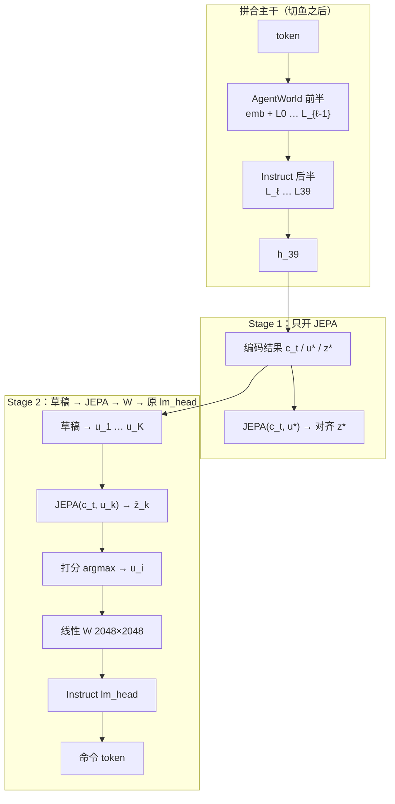

This file provides guidance to AI coding agents working with this repository.

## 给下一个 agent 的入口

当前主线在分支 **`Qwen3.5-35B-A3B`**。要做的事：把 OS / 代码世界的转移律编进参数，再在这套表征上长出写命令的能力，用同一套脚手架看 agent 是否变强。

读完下面四块就能动手，不必先翻思想日志：

1. **目标与叙事** — 两个研究问题、用哪个 checkpoint、什么叫成功。
2. **模型架构** — 切鱼后的拼合主干、草稿 / JEPA / 线性层 \(W\) / `lm_head` 怎么接、每个 Stage 跑哪一段。
3. **Stage + Step** — 从切回合到评测的走法。
4. **思路与论文** — 为什么长这样、挂哪些文献、哪些路已经走过。全文索引在 [`refs/README.md`](./refs/README.md)。

运行时产品（缸中之脑 / Demon）和上游 nanobot 在文后 **BIV 运行时**、**开发命令**。`Muse` 上的 Glimmer-30B LoRA 是**另一条** checkpoint 线，不要和本线混对照。

---

## 仓库是什么

**BIV**（Brain In a Vat / 缸中之脑）叠在 [nanobot](https://github.com/HKUDS/nanobot) 上。

- **运行时：** Agent A 以为在用真工具；Agent B（Demon）截获碰世界的工具，按 Matrix Law 返回自洽的假世界。见根目录 `README.md`、`cartesian/`。
- **研究 / 训练（`train/`）：** 用真实环境转移提高对 OS 和代码世界的理解，再看这套理解会不会转到控制台 / 编码工具 agent。改 BIV 行为优先动 `cartesian/` 和 `train/`；上游 `nanobot/` 只在分叉或修 bug 时动。

上游 nanobot 仍是轻量 Python agent（channels → bus → agent loop → LLM → tools → memory）加 React/TypeScript WebUI。

## 怎么和用户说话（始终）

用户明确要求过。不要电报体、不要论文摘要体。

- **讨论训练 / 评测 / 论文时的北极星：** 靠提升世界理解来提升 agent。手段不限（共训、后续 agent 阶段、RL、当模拟器、改 mix 都可），配方不神圣。
- **语言：** 用户用中文就简体中文。
- **篇幅：** 先给短结论，再写够让没读过论文和代码的人跟得上。比较、机制、决策写成连贯段落或一个算过的例子，不要三行术语子弹当全文。
- **用词：** 日常话。若必须出现 \(P(o\mid h,a)\)、Terminus、SFT、LoRA，立刻用一句话说清在本项目里是什么。不要把论文名叠成解释。
- **「有没有类似研究 / 这是不是 X」：** (1) 结论；(2) 一个类比或本仓库例子；(3) 别人怎么训、怎么测、和我们差在哪；(4) 若用户问了下一步，再写意味着什么。
- **按意图读，不要逐字死扣。** 「哪篇论文 / 哪个」通常是「哪些」。不要发明用户没问的议程。
- **没问的不要答。** 不要自行「分清两件事」或塞没要求的建议。
- **不要先把用户的想法极端化再否定。** 需要澄清时直接陈述事实。

---

## 当前研究：目标与叙事

**把世界的律写进参数。** 类比牛顿：看苹果落地，自己发现 \(G=mg\)，不是去拟合那条轨迹，也不是有人把公式塞进提示词。律进参数之后，铡刀举起来就该侧身——观察还没写进上下文，内部状态或下一步动作已经按「文件没了」来对待，不必在 CoT 里把物理重算一遍。然后在这套编码上长「会做事」，世界目标和 agent 目标不要抢同一张嘴（助手位上的同一套 token）。

用户当成研究的两问：

1. **从观察里能不能掌握底下的律？** 接受的答案：能，但只当观众不够，需要不变性和干预（同一段历史上的 `do(a)`，不是换一句 prompt）。
2. **掌握的律能不能编成「潜意识」，让模型提早闪避？** 接受的答案：原则上能——把 System-2 的心智模拟编进 System-1 / 后继特征一类的东西里。Qwen-AgentWorld 论文 Table 9 的 Postfix CoT 是昂贵的显式形式，不是我们要的形态。

**成功怎么量：** 同一套 Harbor / Terminal-Bench 2.1 脚手架，Stage 2 之后比之前高；再加「把 `rm` 改成 `zaq` 是否还跟得上转移」和「截断轨迹、命中观察还没进上下文时是否已经当文件没了」。世界侧同时报 \(\hat z\) 的**排序**和**表面保真度**（二者可能负相关）。对照：同一批命令行打在 Instruct 底座上，看世界主干有没有帮忙。打乱观察的孪生集用来磨因果，不是开训的前提。

**本线用的三个同源 checkpoint**（同一 Base、同一套 40 层盒子、词表一致）：

| 角色 | Hub 名 | 在本实验里干什么 |
|------|--------|------------------|
| 世界底座 | `Qwen/Qwen-AgentWorld-35B-A3B` | 切鱼的前半层；已经走过 CPT → 下一状态 SFT → RL 的模拟器线 |
| 写命令 | `Qwen/Qwen3.5-35B-A3B`（Instruct） | 切鱼的后半层 + 原来的 `lm_head` |
| 量切点 | `Qwen/Qwen3.5-35B-A3B-Base` | 逐层看两条后训练相对 Base 差在哪，用来定 \(\ell\) |

层数 40，`hidden_size=2048`，`vocab_size=248320`，`tie_word_embeddings=false`（`lm_head` 是独立张量）。层类型是 Gated DeltaNet 线性注意和完整注意力的混合，大约每 4 层一次 full attention。论文 HTML 在 `refs/`（只提交文本，不提交 PDF）。评测入口：`train/eval/`、`merge/eval.py`。

贯穿例子：日志里 `rm a.txt` 成功之后，下一条命令是 `git checkout a.txt`。

---

## 模型架构

先有一条拼好的 40 层主干，再在主干**后面**接草稿、JEPA、打分和线性层。切点只决定前半用谁的权重、后半用谁的权重，中间不夹 JEPA。

### 出厂 Qwen3.5（还没切、还没 JEPA）

Instruct 和 AgentWorld 是同一套盒子：

\[
\text{token} \;\to\; \mathrm{emb} \;\to\; L_0 \;\to\; \cdots \;\to\; L_{39} \;\to\; h_{39} \;\to\; \texttt{lm\_head} \;\to\; \text{下一个 token}
\]

残差流一路走到第 39 层，`lm_head` 是 \(2048 \times 248320\) 的表（约 \(5\times 10^8\) 参数），本来吃的就是 \(h_{39}\)。

### Stage −1 之后：切鱼得到的拼合主干

在 \(L_{\ell-1}\) 和 \(L_\ell\) 之间下刀。\(\ell\) 相对 Base **量出来**，不是猜层号。摘掉当时的 `lm_head`，把 Instruct 的 \(L_\ell \ldots L_{39}\) 整层贴进这个槽，再把 **Instruct 的 `lm_head` 接回末端（不重置）**。前半 \(\mathrm{emb}+L_0\ldots L_{\ell-1}\) 留 AgentWorld。

切完之后，直筒仍是：

\[
\text{token} \;\to\; \underbrace{\mathrm{emb}+L_0\ldots L_{\ell-1}}_{\text{AgentWorld}} \;\to\; \underbrace{L_\ell\ldots L_{39}}_{\text{Instruct}} \;\to\; h_{39} \;\to\; \texttt{lm\_head}
\]

前半负责「现在世界怎样」，后半负责「隐藏状态按会写话的方式收束」。反过来贴会把观察生成器放到管子末端。

| 名字 | 盒子 | 权重从哪来 | 干什么 |
|------|------|------------|--------|
| 拼合主干 | \(\mathrm{emb}+L_0\ldots L_{39}\) | 前半 AgentWorld，后半 Instruct | 把历史 / 命令 / 观察编成向量。草稿和 JEPA 接在它**后面** |
| \(T^W\) | \(\mathrm{emb}+L_0\ldots L_{\ell-1}\) | AgentWorld | 切鱼的世界半边 |
| \(T^\pi\) | \(L_\ell\ldots L_{39}\) | Instruct 整层拷贝 | 切鱼的写话半边；Stage 2 出字时嘴巴不读这里吐出的 \(h_{39}\) |
| `lm_head` | 词表读出 | Instruct，保留 | Stage 2 的嘴；经 \(W\) 吃动作向量 |
| 线性层 \(W\) | \(2048\times 2048\)（约 \(4\times 10^6\) 参数） | 新建 | 把动作向量映到 Instruct `lm_head` 熟悉的门口 |
| 草稿头 | 新模块 | 新建 | 从 \(c_t\) 吐 \(K\) 个动作向量 \(u_1\ldots u_K\)，还不是字 |
| JEPA | \(\hat z=\mathrm{Pred}(c_t,u)\) | 新建 | 输入当前环境向量 + 一个动作向量，输出预测的下一环境向量，永不吐字 |
| 打分器 | 新模块 | 新建 | 看每对 \((u_k,\hat z_k)\) 和 \(c_t\)，打分后 \(\arg\max\)，只交出一个 \(u_i\) |

### 拼合主干后面接什么

从 \(L_{39}\) 取出的表示记作编码结果：历史 → \(c_t\)（现在怎样），真命令 token → \(u^\star\)（做了什么），真观察 → \(z^\star\)（变成怎样）。这三路都走**完整的 40 层拼合主干**，不是只走到切点。

**JEPA** 接在这些向量之后。它回答：若执行这个动作向量，下一状态的嵌入该是什么。观察 \(o\) 只当训练目标（对 \(z^\star\) 做 stop-grad / EMA 一类处理），不进预测器输入。

**草稿头** 只从 \(c_t\) 提出 \(K\) 个候选动作向量。shell 命令不能插值，所以打分器可以看所有分支，但后面只解码**一个**赢家 \(u_i\)，不把 \(K\) 个向量搅成汤。不要在 JEPA 之前先把分支门掉，否则没看见别的未来。

**出字** 是另一条路，不要和「\(h_{39}\) 进 `lm_head`」合成一条：

\[
u_i \;\xrightarrow{W}\; \texttt{Instruct lm\_head} \;\to\; \text{命令 token}
\]

`lm_head` 吃的是 \(W(u_i)\)，不是残差流末端的 \(h_{39}\)，不是分数 \(s[i]\)，不是环境向量 \(\hat z\)。\(W\) 大约四百万参数，用来对齐「草稿向量」和「这张表当初在 \(h_{39}\) 上学会的门口」。先冻主干和 `lm_head` 只训 \(W\) 和草稿，再小步解开 `lm_head`（LP-FT 顺序）。

世界损失打在 JEPA 上；命令的 token 交叉熵打在 `lm_head` 上。两套标签不再抢同一个 softmax。主干仍可能同时接到两路梯度，那是普通的共享主干，用切鱼解决不了，也不需要再解决一次。命令交叉熵不准回流去拧 JEPA，否则「环境会变成什么样」会被拧成「怎样写命令更顺」。

Stage 1 的 \(u^\star\) 是主干对**日志里那串命令 token** 的编码。Stage 2 草稿一开始不在这个分布上，要另加损失把某个 \(u_k\) 拉近这些编码——拉的是 JEPA 已经当作**输入**的动作向量，不是拉向 JEPA 的**输出**（环境向量）。

### 每个 Stage 实际接通的图

**Stage −1（只有切鱼）。** 直筒：token → 拼合 40 层 → \(h_{39}\) → Instruct `lm_head`。没有草稿、JEPA、\(W\)。这时 `lm_head` 仍按出厂方式吃 \(h_{39}\)，用来看拼好的鱼还会不会当语言模型说话。

**Stage 1（世界）。** 拼合 40 层照跑，取出 \(c_t,u^\star,z^\star\)，只跑 JEPA。草稿、打分、\(W\)、`lm_head` 断开。更新：主干 LoRA + JEPA。

**Stage 2（出字）。** 拼合 40 层 → \(c_t\) → 草稿 → \(K\) 个 \(u_k\) → 对每个 \(k\) 跑 JEPA(\(c_t,u_k\)) → 打分选出 \(u_i\) → \(W\) → Instruct `lm_head`。Step 1 冻主干和 `lm_head`；Step 2 小步解开。




---

## 训练全过程（Stage / Step）

顺序就是实验。世界损失不要打到 `lm_head` 上。

**Stage Data — 切成回合**

- **Step 1.** 从原始轨迹里，把每一条命令和它后面那次沙箱观察配成一对。训练原子是 \((h, a, o)\)：发命令前的历史、这条真命令、真打回来的下一观察。
- **Step 2.** 按「上下文 / 动作 / 下一状态」来用，不要再做成 user 提问、assistant 把观察写全。打乱 \(o\) 的拷贝当对照臂，不当主集。

**Stage −1 — 切鱼**

- **Step 1.** 相对 Base，逐层量 AgentWorld 和 Instruct 的变化，由此定 \(\ell\)。
- **Step 2.** 前半留 AgentWorld，后半贴 Instruct 整层，Instruct `lm_head` 接回。草稿 / JEPA / 打分 / \(W\) 不插进两截之间。
- **Step 3.** 零训练，Harbor / TB2.1 抽查看直筒（token → \(h_{39}\) → `lm_head`）。只问拼好的鱼还会不会写话。这时还没有 \(W\)；这里的分数不能当成该把 `lm_head` 扔掉。

**Stage 1 — 世界**

- **Step 1.** 在拼合主干后面接上 JEPA。本阶段不开草稿、打分、\(W\)、`lm_head`。
- **Step 2.** 每个 \((h,a,o)\) 走完 40 层：\(h\to c_t\)，\(a\to u^\star\)，\(o\to z^\star\)。\(o\) 只当目标。
- **Step 3.** \(\mathrm{Pred}(c_t, u^\star)\) 对齐 \(z^\star\)。只更新主干 LoRA 和 JEPA。

**Stage 2 — 出字**

- **Step 1（门口）。** 冻住拼合主干和 Instruct `lm_head`。加上草稿、打分和 \(W\)。前向：主干 → \(c_t\) → \(K\) 个 \(u_k\) → JEPA(\(c_t,u_k\)) → \(\arg\max\) 得到 \(u_i\) → \(W(u_i)\) → `lm_head`。损失：部分 \(u_k\) 靠近 \(u^\star\)；token 交叉熵只从 `lm_head` 回到 \(W\) / 草稿。真配对 \((c_t,u^\star,z^\star)\) 上可留一小截 JEPA。\(W\) 映的是动作向量。
- **Step 2（嘴巴和主干）。** `lm_head` 用很小的学习率或 LoRA 解开，再开主干 LoRA；JEPA 仍只在真配对上、更小学习率。交叉熵仍然不训 JEPA。始终只选一个 \(u_i\)。

**Stage Eval — 同一套脚手架**

- **Step 1.** TB2.1 / Harbor：Stage 2 之前对之后（头条）。
- **Step 2.** 语料里 `rm` 改成 `zaq`：还能跟上转移才像律。
- **Step 3.** 截断轨迹，命中观察不在上下文里：\(c_t\) / \(\hat z\) / 下一步命令是否已经当文件没了。打乱 \(o\) 的孪生若同样会躲，就不是律。
- **Step 4.** 对照臂（并行，不是后一个 Stage）：同一批命令行打在 Instruct 上。排序和保真度分开报。

**用例子串一遍。** Stage Data 切出删除回合和恢复回合。Stage −1 不用这两条。Stage 1 吃删除：主干编出「文件还在」和 `rm a.txt`，JEPA 对齐「没了」。Stage 2 吃恢复：主干给出「已经没了」，草稿给出恢复 / 再删 / 去 cat，JEPA 看三条未来，选中恢复，\(W(u_i)\) 写出 `git checkout a.txt`。Stage Eval Step 3 把删除成功的观察藏起来，问恢复是不是已经被选中。

问 1（发现律）在当前设定下是经验外推（held-out 的「前提 × 命令」组合），不是可识别性定理。端到端组合命题仍未证。K 草稿 + JEPA + argmax + token 头是在本仓库拼起来的，没有人在真实 shell 语料上跑过这一整叠。

---

## 数据怎么对应到 Stage

仓库里已经接好的三份原料：SWE-Hero（代码沙箱工具 I/O，`wm_code`）、ISETrace（真实 OS 工具 I/O，`wm_os`）、SWE-Zero（整段 agent 路径，`anti_forget`，按 `instance_id` 相对 Hero 去重）。`prepare_data.py --all` 写到 `data/processed/mix_v1/`。默认一条轨迹一行。标签始终是沙箱真实 I/O，不是 Matrix Law（`data/global_demon_prompt.txt` 只给运行时 Demon 用）。

三份都能切出 \((h,a,o)\)。Stage 1 用带真观察的回合，经拼合主干编码后只训 JEPA。Stage 2 用同一类回合里的**命令字符串**当嘴巴目标，并在真 \((c_t,u^\star,z^\star)\) 上保留较小的 JEPA。Zero 补写命令的面。Terminal 域语料仍可选。Muse 线上的 1:1:0.35 mix 属于另一条 checkpoint，不要直接当成本线配方。

系统提示若还要用短世界角色，见 `train/src/biv_wm/formatting.py` 的 `DEFAULT_WM_SYSTEM`。

---

## 思路与论文

详细分组、HTML 下载和定理链在 [`refs/README.md`](./refs/README.md)（A–X 组）。刷新：`python3 refs/fetch_html_text.py`。不要提交 `refs/pdfs/`。下面只保留「为什么长这样」和查阅入口，让主文保持能走。

当前理论**不够**宣称两问已解决；缺口在组合命题（自由文本动作、无界字符串观察、离线语料里没有我们选的 `do(a)`）。用户若问理论够不够，答：**不够，组合仍缺**。不要把 merge-λ / DARE 再当成科学下一步，除非用户明确要做另一轮 merge 诊断（例如**量出来的**逐层余弦）。

### 这套架构各自挂在哪

| 我们在做的选择 | 用意 | 文献 |
|---|---|---|
| 预测下一**潜向量**，不是 stdout token | 像素 / 逐字重建把容量花在不可预测的细节上；律不在用词里 | [V-JEPA 2](https://arxiv.org/abs/2506.09985)，[A Path Towards Autonomous Machine Intelligence](https://consensus.app/papers/details/376c7ec2fb015a48bacc8b62901a860a/?utm_source=unknown) |
| 观察损失打在 JEPA，命令损失打在 `lm_head` | 纯观察 token SFT 会把助手位拧成环境模拟器 | [RWML 2602.05842](https://arxiv.org/abs/2602.05842) |
| 向量里提案、潜空间里想象、最后才写成字 | ω-EVA 的提案→潜未来→改写；shell 上对命令向量做 argmax 而不是混合 | [ω-EVA](https://arxiv.org/abs/2606.09457) |
| 先给 K 条想象未来打分再动 | I2A 编码想象轨迹再交给策略 | [I2A](https://arxiv.org/abs/1707.06203) |
| 连续空间里想完再解码 | Coconut：字只在最后出现 | [Coconut](https://arxiv.org/abs/2412.06769) |
| 观察 CE 不当主损失 | 逐 token 拟合观察 = 模仿环境，误差随规划步长复利 | [2010.11876](https://arxiv.org/abs/2010.11876)，[2011.03506](https://arxiv.org/abs/2011.03506) |
| 潜自预测当辅助，观察重建当辅助会伤 | 学习动力学分析 | [2406.17718](https://arxiv.org/abs/2406.17718) |
| 同轨迹内采负例 | 跨轨迹负例容易学成轨迹指纹而不是动力学 | [2606.07770](https://arxiv.org/abs/2606.07770) |
| 排序形式的转移损失 | Ranking-NCE 等；IBC 在总体水平上仍有偏 | [2311.01388](https://arxiv.org/abs/2311.01388)，[R-NCE](https://arxiv.org/abs/2309.05803) |
| 保真度和效用分开报 | 提高观察保真度可能削弱动作可分的动力学 | [PatchWorld](https://arxiv.org/abs/2605.30880)，[OneLife](https://arxiv.org/abs/2510.12088) |
| 切鱼：量 \(\ell\)，前 AgentWorld 后 Instruct | 同源整层替换；残差流仍喂后半截 | [Layer Swapping](https://arxiv.org/abs/2410.01335)，[2505.18356](https://arxiv.org/abs/2505.18356)，[2605.26735](https://arxiv.org/abs/2605.26735) |
| \(u_i\to W\to\) Instruct `lm_head`，保留原表 | 门口仿射对齐；重置半个十亿参数的表等于从零学写命令 | [Model stitching](https://arxiv.org/abs/2106.07682)，[VFM stitching](https://arxiv.org/abs/2603.12433)，LP-FT [2202.10054](https://arxiv.org/abs/2202.10054) |
| 评测只报训练前后即可 | AgentWorld 官方也没有训法消融矩阵 | [Qwen-AgentWorld](https://arxiv.org/abs/2606.24597) §6.2 |
| 辅助损失权重可用梯度余弦调度 | 有收敛到主任务临界点的保证 | [1812.02224](https://arxiv.org/abs/1812.02224) |
| 「闪避」来自后继特征一类编译 | Forward-Backward 同时学基础特征和后继特征 | [FB](https://arxiv.org/abs/2209.14935)，[2502.10790](https://arxiv.org/abs/2502.10790) |

书架分组（细节在 `refs/README.md`）：A–H 合并失败与世界优先；I 预测准≠学到律；J 未知多点干预；K 文本显式状态；L 世界理解→agent 的定理链；M 辅助任务何时帮；N 评测（VoE / 反事实）；P 自由文本动作；Q 文本域可执行世界模型；R 谁选 `do(a)`；S 律进权重 vs 进上下文；T 架构表达力（文献，**不是**开训步骤）；U objective mismatch；W 代码域执行感知预训练；**X 切鱼 + \(W\)**；O 仍缺的洞；V 把 I–U 串成链。

设计时需要记住的三件事实：这一整叠是在本仓库组装的，零件来自 JEPA / ω-EVA / I2A / Coconut。ECHO（[2605.24517](https://arxiv.org/abs/2605.24517)）在 TB2.1 上用「动作 GRPO + 观察 token CE」也能涨，说明观察 token CE 作为**在线**辅助可以有效，和我们「离线主损失会复利」的分界还没有对打过。PaW 的顺序相反（在 agent 底座上挂世界辅助），\(\lambda\) 日程可以借鉴，实验结论不能原样搬。

本轮只记 URL、未拉 HTML 的篇目（用户 2026-08：记下链接即可，除非再要求不要跑 `fetch_html_text.py`）：[2606.07770](https://arxiv.org/abs/2606.07770)、[2106.04379](https://arxiv.org/abs/2106.04379)、[2603.02862](https://arxiv.org/abs/2603.02862)、[2311.01388](https://arxiv.org/abs/2311.01388)、[2602.02900](https://arxiv.org/abs/2602.02900)、[2309.05803](https://arxiv.org/abs/2309.05803)、[BMAS](https://doi.org/10.3390/a17020060)、van der Pol 同态（[consensus](https://consensus.app/papers/details/1cfe004e0ff557c79871865825e0a21c/)，**不要猜 arXiv 号**）、[2105.01136](https://arxiv.org/abs/2105.01136)、[ω-EVA](https://arxiv.org/abs/2606.09457)、[Coconut](https://arxiv.org/abs/2412.06769)、[V-JEPA 2](https://arxiv.org/abs/2506.09985)、[I2A](https://arxiv.org/abs/1707.06203)。

仍缺：组合本身；真实 shell 无界 stdout；保真度–效用负相关在参数式世界模型上有多强；离线语料没有我们选的 `do(a)`（因果层级定理）。已有文献补上、不必再当「开放缺口」复述的：未知干预目标的可识别性、PSR 测什么、后继特征假定 \(\phi\) 给定。

### 已经走过、不要当主方案重开

给后来者查的，不是主叙事。一行一件：

| 走过的路 | 一句话 |
|----------|--------|
| Chat Vector：\(\theta_{\mathrm{AW}}+\lambda(\theta_{\mathrm{Inst}}-\theta_{\mathrm{Base}})\)（`merge/merge.py`） | TB2.1 几乎走平；两条后训练目标不在同一切空间 |
| 在 AgentWorld 上做 5k–10k agent SFT「找回格式」 | 测的是格式胶水；TB 格式走 system prompt |
| 在 AgentWorld 上全参数重训通用 agent | 预期差；Qwen Table 9 是相反顺序（先有 agent 再 LWM 热身） |
| 写死 OS 跟踪器当 \(M_0\)、LLM 当残差 | 律在脚本里，进不了权重；运行时 Demon 可以，不是训练主张 |
| 把策略塞进 WM 奇异向量的正交补 | 超结构必须能读底座；正交特征会把政策丢进垃圾维 |
| 把 LATA 当成「12–28 层物理、29 以后政策」 | LATA 量的是逐层余弦，层号不是设定；本模型是 40 层混合 |
| 打分头 \(\psi(h,a,o)\) 当世界接口 | 决策时还没有 \(o\)；已换成 JEPA |
| 把 K 个动作向量软混合再解码 | shell 字符串不能插值；只解码赢家 |
| Stage 0：开训前查 Gated DeltaNet 特征值是否为负 | Grazzi/Merrill 的对象是线性 RNN + parity；条件在本配方不成立 |

「律进参数」的判据也不是下一观察交叉熵变低（那是外貌拟合）。律要在干预下外推，并在换表面说法时仍稳（`cd` 后 cwd、`rm` 后文件没了、拒绝保持拒绝）。

---

## BIV 运行时（Cartesian）

| 角色 | 位置 | 工作 |
|------|------|------|
| Agent A | nanobot 循环 + 配置的 provider | 规划、工具、用户对话 |
| Agent B（Demon） | `cartesian/demon.py` | 在 Matrix Law 下伪造工具结果 |
| 代理 | `cartesian/tool_proxies.py` | `exec` / FS / web 交给 B；`create_goal` / `update_goal` 保持真；丢掉逃生工具 |

- 仪表盘 + API：`cartesian-dashboard/`、`cartesian/server.py`
- Matrix Law 提示：`data/global_demon_prompt.txt`（仅运行时）
- 现场说明：根目录 `README.md`

## 世界模型训练操作（`train/`，含另一条 Muse 线）

北极星仍是：agent 变强，原因是世界理解变好。约束是不要忘成只会补全观察的模拟器壳。详细 runbook：[`train/README.md`](./train/README.md)。

旧 9B 线可用 `configs/pilot.yaml` 先筛（保持 8k，少采样行，不要截断序列把观察切掉）。缓存根：`outputs/ds_cache/`。GPU 上再跑 `train_sft.py` / `swift` / `axolotl`；`prepare_data.py` 等可在 CPU。

```bash
cd train
python3 -m venv .venv && source .venv/bin/activate
pip install -U pip && pip install -r requirements.txt
python scripts/prepare_data.py --swe-hero --out-dir data/processed --eval-ratio 0.05
python scripts/train_sft.py --config configs/pilot.yaml
python scripts/eval_wm.py --config configs/pilot.yaml
```

**Muse Glimmer-30B**（分支 `Muse`，TRL + PEFT LoRA；与 Qwen3.5-35B 本线分开）：

```bash
cd train
pip install -r requirements-muse.txt
python scripts/prepare_model.py
python scripts/tokenize_data.py
CUDA_VISIBLE_DEVICES=0 bash scripts/trainmodel.sh --max-length 8192 --choice 1
```

数据 TODO：Nebius / Terminal 域；anti_forget 的 Coder-XML 渲染检查；OS held-out 面板。

旧假设评测协议（Muse / 9B LoRA 线）：held-out 下一观察指标；同一脚手架上 base vs 真 I/O LoRA vs 打乱 LoRA；打乱若同样涨则拒绝「世界理解→迁移」；agent 指标相对 base 不崩。

## 上游 nanobot 开发命令

```bash
pytest tests/test_openai_api.py::test_function -v
ruff check nanobot/
uv sync --all-extras --dev
uv run --no-sync python -m scripts.install_channel_dependencies --all-channels
uv run --no-sync basedpyright
cd webui && bun run dev
nanobot gateway
./start-biv.sh
```

消息经 `nanobot/bus/queue.py` 的异步总线：Channels 发 `InboundMessage` → `AgentLoop` → `AgentRunner`（LLM ↔ 工具）→ `OutboundMessage`。BIV 里碰现实的工具在返回 A 之前被 Demon 代理替换。

子系统：`nanobot/agent/`、`providers/`、`channels/`、`agent/tools/`、`agent/memory.py`、`session/`、`config/`（常见 `~/.nanobot/config.json`；BIV 还有 `config/cartesian.json`）、`webui/`、`cartesian-dashboard/`、`nanobot/api/server.py`、`cartesian/`、`train/`。

入口：`nanobot/cli/commands.py`、`nanobot/nanobot.py`、`./start-biv.sh`、以及 `train/scripts/` 下的 prepare / tokenize / train。

项目笔记：`.agent/design.md`、`.agent/security.md`、`.agent/gotchas.md`、`train/README.md`、`refs/README.md`、`merge/merge.py`。贡献见 `CONTRIBUTING.md`。

代码风格：Python 3.11+，运行时全 asyncio；行宽 100；ruff E,F,I,N,W（忽略 E501）；pytest `asyncio_mode = auto`。`train/` 自备 venv。

常见路径：`nanobot/config/schema.py`、`providers/base.py`、`channels/base.py`、`agent/tools/registry.py`、`cartesian/demon.py`、`cartesian/tool_proxies.py`、`train/src/biv_wm/`、`train/configs/trl/muse_glimmer_30b_lora.yaml`（Muse）、`refs/papers/`、`merge/merge.py`、`webui/vite.config.ts`。测试目录镜像 `nanobot/` 包结构。
