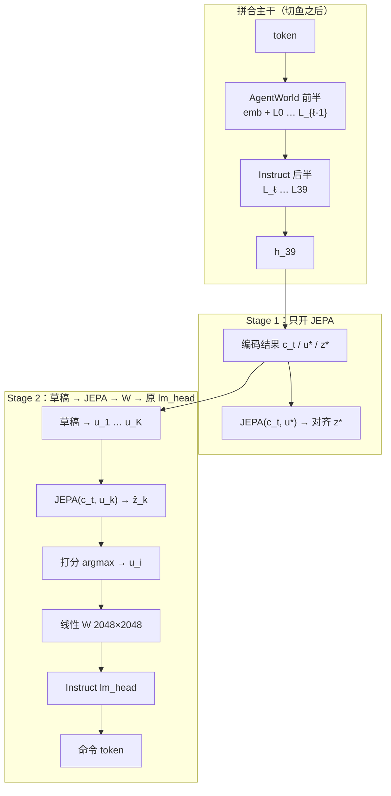

This file provides guidance to AI coding agents working with this repository.

## 给下一个 agent 的入口

当前主线在分支 **`agentworld-JEPA-Qwen3.5-35B-A3B`**。要做的事：把 OS / 代码世界的转移律编进参数，再在这套表征上长出写命令的能力，用同一套脚手架看 agent 是否变强。

读完下面三块就能动手。文末 **灵感来源** 写最终方案各零件对应哪些论文；**论文链接** 给出全部编号条目（含检索过但方案未直接引用的）。HTML 全文在 [`refs/`](./refs/)（只提交文本，不提交 PDF）。

1. **目标与叙事** — 两个研究问题、用哪个 checkpoint、什么叫成功。
2. **模型架构** — 切鱼后的拼合主干、草稿 / JEPA / 线性层 \(W\) / `lm_head` 怎么接、每个 Stage 跑哪一段。
3. **Stage + Step** — 从切回合到评测的走法。

运行时产品（缸中之脑 / Demon）和上游 nanobot 在文后 **BIV 运行时**、**开发命令**。`Muse` 上的 Glimmer-30B LoRA 是**另一条** checkpoint 线，不要和本线混对照。

---

## 仓库是什么

**BIV**（Brain In a Vat / 缸中之脑）叠在 [nanobot](https://github.com/HKUDS/nanobot) 上。

- **运行时：** Agent A 以为在用真工具；Agent B（Demon）截获碰世界的工具，按 Matrix Law 返回自洽的假世界。见根目录 `README.md`、`cartesian/`。
- **研究 / 训练（`train/`）：** 用真实环境转移提高对 OS 和代码世界的理解，再看这套理解会不会转到控制台 / 编码工具 agent。改 BIV 行为优先动 `cartesian/` 和 `train/`；上游 `nanobot/` 只在分叉或修 bug 时动。

上游 nanobot 仍是轻量 Python agent（channels → bus → agent loop → LLM → tools → memory）加 React/TypeScript WebUI。

## 怎么和用户说话（始终）

用户明确要求过。不要电报体、不要论文摘要体。

- **讨论训练 / 评测 / 论文时的北极星：** 靠提升世界理解来提升 agent。手段不限（共训、后续 agent 阶段、RL、当模拟器、改 mix 都可），配方不神圣。
- **语言：** 用户用中文就简体中文。
- **篇幅：** 先给短结论，再写够让没读过论文和代码的人跟得上。比较、机制、决策写成连贯段落或一个算过的例子，不要三行术语子弹当全文。
- **用词：** 日常话。若必须出现 \(P(o\mid h,a)\)、Terminus、SFT、LoRA，立刻用一句话说清在本项目里是什么。不要把论文名叠成解释。
- **「有没有类似研究 / 这是不是 X」：** (1) 结论；(2) 一个类比或本仓库例子；(3) 别人怎么训、怎么测、和我们差在哪；(4) 若用户问了下一步，再写意味着什么。
- **按意图读，不要逐字死扣。** 「哪篇论文 / 哪个」通常是「哪些」。不要发明用户没问的议程。
- **没问的不要答。** 不要自行「分清两件事」或塞没要求的建议。
- **不要先把用户的想法极端化再否定。** 需要澄清时直接陈述事实。

---

## 当前研究：目标与叙事

**把世界的律写进参数。** 类比牛顿：看苹果落地，自己发现 \(G=mg\)，不是去拟合那条轨迹，也不是有人把公式塞进提示词。律进参数之后，铡刀举起来就该侧身——观察还没写进上下文，内部状态或下一步动作已经按「文件没了」来对待，不必在 CoT 里把物理重算一遍。然后在这套编码上长「会做事」，世界目标和 agent 目标不要抢同一张嘴（助手位上的同一套 token）。

用户当成研究的两问：

1. **从观察里能不能掌握底下的律？** 接受的答案：能，但只当观众不够，需要不变性和干预（同一段历史上的 `do(a)`，不是换一句 prompt）。
2. **掌握的律能不能编成「潜意识」，让模型提早闪避？** 接受的答案：原则上能——把 System-2 的心智模拟编进 System-1 / 后继特征一类的东西里。Qwen-AgentWorld 论文 Table 9 的 Postfix CoT 是昂贵的显式形式，不是我们要的形态。

**成功怎么量：** 同一套 Harbor / Terminal-Bench 2.1 脚手架，Stage 2 之后比之前高；再加「把 `rm` 改成 `zaq` 是否还跟得上转移」和「截断轨迹、命中观察还没进上下文时是否已经当文件没了」。世界侧同时报 \(\hat z\) 的**排序**和**表面保真度**。对照：同一批命令行打在 Instruct 底座上，看世界主干有没有帮忙。打乱观察的孪生集作因果对照。

**本线用的三个同源 checkpoint**（同一 Base、同一套 40 层盒子、词表一致）：

| 角色 | Hub 名 | 在本实验里干什么 |
|------|--------|------------------|
| 世界底座 | `Qwen/Qwen-AgentWorld-35B-A3B` | 切鱼的前半层；该线经过 CPT → 下一状态 SFT → RL |
| 写命令 | `Qwen/Qwen3.5-35B-A3B`（Instruct） | 切鱼的后半层 + 原来的 `lm_head` |
| 量切点 | `Qwen/Qwen3.5-35B-A3B-Base` | 逐层看两条后训练相对 Base 差在哪，用来定 \(\ell\) |

层数 40，`hidden_size=2048`，`vocab_size=248320`，`tie_word_embeddings=false`（`lm_head` 是独立张量）。层类型是 Gated DeltaNet 线性注意和完整注意力的混合，大约每 4 层一次 full attention。评测入口：`train/eval/`、`merge/eval.py`。

贯穿例子：日志里 `rm a.txt` 成功之后，下一条命令是 `git checkout a.txt`。

---

## 模型架构

先有一条拼好的 40 层主干，再在主干**后面**接草稿、JEPA、打分和线性层。切点只决定前半用谁的权重、后半用谁的权重，中间不夹 JEPA。

### 出厂 Qwen3.5（还没切、还没 JEPA）

Instruct 和 AgentWorld 是同一套盒子：

\[
\text{token} \;\to\; \mathrm{emb} \;\to\; L_0 \;\to\; \cdots \;\to\; L_{39} \;\to\; h_{39} \;\to\; \texttt{lm\_head} \;\to\; \text{下一个 token}
\]

残差流一路走到第 39 层，`lm_head` 是 \(2048 \times 248320\) 的表（约 \(5\times 10^8\) 参数），本来吃的就是 \(h_{39}\)。

### Stage −1 之后：切鱼得到的拼合主干

在 \(L_{\ell-1}\) 和 \(L_\ell\) 之间下刀。\(\ell\) 相对 Base 逐层量出来。摘掉当时的 `lm_head`，把 Instruct 的 \(L_\ell \ldots L_{39}\) 整层贴进这个槽，再把 **Instruct 的 `lm_head` 接回末端（保留原表）**。前半 \(\mathrm{emb}+L_0\ldots L_{\ell-1}\) 留 AgentWorld。

切完之后，直筒仍是：

\[
\text{token} \;\to\; \underbrace{\mathrm{emb}+L_0\ldots L_{\ell-1}}_{\text{AgentWorld}} \;\to\; \underbrace{L_\ell\ldots L_{39}}_{\text{Instruct}} \;\to\; h_{39} \;\to\; \texttt{lm\_head}
\]

前半负责「现在世界怎样」，后半负责「隐藏状态按会写话的方式收束」。

| 名字 | 盒子 | 权重从哪来 | 干什么 |
|------|------|------------|--------|
| 拼合主干 | \(\mathrm{emb}+L_0\ldots L_{39}\) | 前半 AgentWorld，后半 Instruct | 把历史 / 命令 / 观察编成向量。草稿和 JEPA 接在它**后面** |
| \(T^W\) | \(\mathrm{emb}+L_0\ldots L_{\ell-1}\) | AgentWorld | 切鱼的世界半边 |
| \(T^\pi\) | \(L_\ell\ldots L_{39}\) | Instruct 整层拷贝 | 切鱼的写话半边；Stage 2 出字时嘴巴不读这里吐出的 \(h_{39}\) |
| `lm_head` | 词表读出 | Instruct，保留 | Stage 2 的嘴；经 \(W\) 吃动作向量 |
| 线性层 \(W\) | \(2048\times 2048\)（约 \(4\times 10^6\) 参数） | 新建 | 把动作向量映到 Instruct `lm_head` 熟悉的门口 |
| 草稿头 | 新模块 | 新建 | 从 \(c_t\) 吐 \(K\) 个动作向量 \(u_1\ldots u_K\)，还不是字 |
| JEPA | \(\hat z=\mathrm{Pred}(c_t,u)\) | 新建 | 输入当前环境向量 + 一个动作向量，输出预测的下一环境向量，永不吐字 |
| 打分器 | 新模块 | 新建 | 看每对 \((u_k,\hat z_k)\) 和 \(c_t\)，打分后 \(\arg\max\)，只交出一个 \(u_i\) |

### 拼合主干后面接什么

从 \(L_{39}\) 取出的表示记作编码结果：历史 → \(c_t\)（现在怎样），真命令 token → \(u^\star\)（做了什么），真观察 → \(z^\star\)（变成怎样）。这三路都走**完整的 40 层拼合主干**。

**JEPA** 接在这些向量之后。它回答：若执行这个动作向量，下一状态的嵌入该是什么。观察 \(o\) 只当训练目标（对 \(z^\star\) 做 stop-grad / EMA 一类处理），不进预测器输入。

**草稿头** 只从 \(c_t\) 提出 \(K\) 个候选动作向量。打分器看完所有分支的 JEPA 预测之后，只解码**一个**赢家 \(u_i\)。

**出字** 走单独一路：

\[
u_i \;\xrightarrow{W}\; \texttt{Instruct lm\_head} \;\to\; \text{命令 token}
\]

`lm_head` 吃的是 \(W(u_i)\)。残差流末端的 \(h_{39}\)、打分 \(s[i]\)、环境向量 \(\hat z\) 都不进这张表。\(W\) 大约四百万参数，把草稿向量映到这张表当初在 \(h_{39}\) 上学会的门口。先冻主干和 `lm_head` 只训 \(W\) 和草稿，再小步解开 `lm_head`。

世界损失打在 JEPA 上；命令的 token 交叉熵打在 `lm_head` 上。命令交叉熵不回流到 JEPA。主干可以同时接到两路梯度（共享主干）。

Stage 1 的 \(u^\star\) 是主干对**日志里那串命令 token** 的编码。Stage 2 另加损失，把某个 \(u_k\) 拉近这些编码：拉的是 JEPA 的**输入**（动作向量）。

### 每个 Stage 实际接通的图

**Stage −1（只有切鱼）。** 直筒：token → 拼合 40 层 → \(h_{39}\) → Instruct `lm_head`。没有草稿、JEPA、\(W\)。这时 `lm_head` 仍按出厂方式吃 \(h_{39}\)，用来看拼好的鱼还会不会当语言模型说话。

**Stage 1（世界）。** 拼合 40 层照跑，取出 \(c_t,u^\star,z^\star\)，只跑 JEPA。草稿、打分、\(W\)、`lm_head` 断开。更新：主干 LoRA + JEPA。

**Stage 2（出字）。** 拼合 40 层 → \(c_t\) → 草稿 → \(K\) 个 \(u_k\) → 对每个 \(k\) 跑 JEPA(\(c_t,u_k\)) → 打分选出 \(u_i\) → \(W\) → Instruct `lm_head`。Step 1 冻主干和 `lm_head`；Step 2 小步解开。




### 训练库

本线用 **`torch` + HuggingFace `transformers` + `peft` + `accelerate`（FSDP2）**。训练循环自己写。FSDP wrap `Qwen3_5MoeDecoderLayer`。

Muse 线用的是同一组库里的 **TRL `SFTTrainer`**（观察 token 交叉熵）。旧 9B 线是 Unsloth。Coder-Next 是 Axolotl。这三条都不覆盖切鱼和 JEPA，本线不用它们当 trainer。

切鱼与框架可行性：`python train/scripts/probe.py`（读 `merge/output/cache` 里已下载的三个 checkpoint，写出 `train/outputs/probe/`）。权重比对结束后，`report.json` 里的 **`recommended_cut`** 就是切点 \(\ell\)：只在 4 层一组的边界（4, 8, …, 36）上，取「后半 Instruct/AgentWorld 相对 Base 位移比的均值 − 前半」最大的那一档。2026-08-30 那次 probe 上是 **\(\ell=12\)**（8 和 16 接近）。不必手算；`cut_stage1.py` 会读这份报告。

盒子是 HuggingFace 的 `Qwen3_5MoeForConditionalGeneration`：40 层文本主干在 `model.language_model` 里，每层都是 MoE；30 层 Gated DeltaNet（`linear_attn`）+ 10 层完整注意力（`self_attn`，层号 3,7,…,39）；256 专家、每 token 8 个加 1 个共享专家。`lm_head` 独立。Instruct 另外还有 `model.visual`（ViT）和 `mtp.*`（官方投机解码草稿）。AgentWorld 的 `language_model_only=true`。

切鱼入口：`python train/scripts/cut_stage1.py`（CPU 流式，写出 `train/outputs/stage1_cut/`：前半 AgentWorld、后半 + `lm_head` + 末层 norm 用 Instruct，丢掉 ViT/MTP）。Stage 1 JEPA：`python train/scripts/train_jepa.py --config train/configs/jepa/stage1.yaml`。数据仍用 `prepare_data.py` 已经写好的 `wm_code` / `wm_os` JSONL（`mix_v2` 优先，没有则 `mix_v1`；**不要** `anti_forget`）。LoRA 只打 2D 线性叶子（专家 3D `gate/up/down` 不套 Muse 那套名字）。FSDP wrap `Qwen3_5MoeDecoderLayer`（`train/configs/accelerate/qwen35_moe_fsdp2.yaml`）。

---

## 训练全过程（Stage / Step）

顺序就是实验。世界损失不要打到 `lm_head` 上。

**Stage Data — 切成回合**

- **Step 1.** 从原始轨迹里，把每一条命令和它后面那次沙箱观察配成一对。训练原子是 \((h, a, o)\)：发命令前的历史、这条真命令、真打回来的下一观察。
- **Step 2.** 按「上下文 / 动作 / 下一状态」来用。打乱 \(o\) 的拷贝当对照臂。

**Stage −1 — 切鱼**

- **Step 1.** 相对 Base，逐层量 AgentWorld 和 Instruct 的变化。`python train/scripts/probe.py` 把 \(\ell\) 写进 `recommended_cut`（规则见上；这组数据上 \(\ell=12\)）。只看切点可以：`python train/scripts/cut_stage1.py --print-cut`。
- **Step 2.** `python train/scripts/cut_stage1.py`：前半留 AgentWorld，后半贴 Instruct 整层，Instruct `lm_head` 接回。草稿 / JEPA / 打分 / \(W\) 不插进两截之间。可用 `--cut 12` 覆盖自动 \(\ell\)。
- **Step 3.** 零训练，Harbor / TB2.1 抽查看直筒（token → \(h_{39}\) → `lm_head`）。这时还没有 \(W\)。

**Stage 1 — 世界**

- **Step 1.** 在拼合主干后面接上 JEPA。本阶段不开草稿、打分、\(W\)、`lm_head`。
- **Step 2.** 每个 \((h,a,o)\) 走完 40 层：\(h\to c_t\)，\(a\to u^\star\)，\(o\to z^\star\)。\(o\) 只当目标。mix JSONL 里 user = 工具调用、assistant = 真观察。
- **Step 3.** \(\mathrm{Pred}(c_t, u^\star)\) 对齐 \(z^\star\)。只更新主干 LoRA 和 JEPA：`python train/scripts/train_jepa.py --config train/configs/jepa/stage1.yaml`。

**Stage 2 — 出字**

- **Step 1（门口）。** 冻住拼合主干和 Instruct `lm_head`。加上草稿、打分和 \(W\)。前向：主干 → \(c_t\) → \(K\) 个 \(u_k\) → JEPA(\(c_t,u_k\)) → \(\arg\max\) 得到 \(u_i\) → \(W(u_i)\) → `lm_head`。损失：部分 \(u_k\) 靠近 \(u^\star\)；token 交叉熵只从 `lm_head` 回到 \(W\) / 草稿。真配对 \((c_t,u^\star,z^\star)\) 上可留一小截 JEPA。\(W\) 映的是动作向量。
- **Step 2（嘴巴和主干）。** `lm_head` 用很小的学习率或 LoRA 解开，再开主干 LoRA；JEPA 仍只在真配对上、更小学习率。交叉熵仍然不训 JEPA。始终只选一个 \(u_i\)。

**Stage Eval — 同一套脚手架**

- **Step 1.** TB2.1 / Harbor：Stage 2 之前对之后（头条）。
- **Step 2.** 语料里 `rm` 改成 `zaq`：还能跟上转移才像律。
- **Step 3.** 截断轨迹，命中观察不在上下文里：\(c_t\) / \(\hat z\) / 下一步命令是否已经当文件没了。打乱 \(o\) 的孪生作对照。
- **Step 4.** 对照臂（与主线并行）：同一批命令行打在 Instruct 上。排序和保真度分开报。

**用例子串一遍。** Stage Data 切出删除回合和恢复回合。Stage −1 不用这两条。Stage 1 吃删除：主干编出「文件还在」和 `rm a.txt`，JEPA 对齐「没了」。Stage 2 吃恢复：主干给出「已经没了」，草稿给出恢复 / 再删 / 去 cat，JEPA 看三条未来，选中恢复，\(W(u_i)\) 写出 `git checkout a.txt`。Stage Eval Step 3 把删除成功的观察藏起来，问恢复是不是已经被选中。

---

## 数据怎么对应到 Stage

仓库里已经接好的三份原料：SWE-Hero（代码沙箱工具 I/O，`wm_code`）、ISETrace（真实 OS 工具 I/O，`wm_os`）、SWE-Zero（整段 agent 路径，`anti_forget`，按 `instance_id` 相对 Hero 去重）。`prepare_data.py --wm-code --wm-os` 写到 `data/processed/mix_v1/`（或你指定的 `--out-dir`，本线优先读已有的 `mix_v2`）。默认一条轨迹一行。标签始终是沙箱真实 I/O。`data/global_demon_prompt.txt` 只给运行时 Demon 用。

三份都能切出 \((h,a,o)\)。Stage 1 用带真观察的回合，经拼合主干编码后只训 JEPA。Stage 2 用同一类回合里的**命令字符串**当嘴巴目标，并在真 \((c_t,u^\star,z^\star)\) 上保留较小的 JEPA。Zero 补写命令的面。Terminal 域语料仍可选。Muse 线上的 1:1:0.35 mix 属于另一条 checkpoint，不要直接当成本线配方。

系统提示若还要用短世界角色，见 `train/src/biv_wm/formatting.py` 的 `DEFAULT_WM_SYSTEM`。

---

## BIV 运行时（Cartesian）

| 角色 | 位置 | 工作 |
|------|------|------|
| Agent A | nanobot 循环 + 配置的 provider | 规划、工具、用户对话 |
| Agent B（Demon） | `cartesian/demon.py` | 在 Matrix Law 下伪造工具结果 |
| 代理 | `cartesian/tool_proxies.py` | `exec` / FS / web 交给 B；`create_goal` / `update_goal` 保持真；丢掉逃生工具 |

- 仪表盘 + API：`cartesian-dashboard/`、`cartesian/server.py`
- Matrix Law 提示：`data/global_demon_prompt.txt`（仅运行时）
- 现场说明：根目录 `README.md`

## 世界模型训练操作（`train/`，含另一条 Muse 线）

北极星仍是：agent 变强，原因是世界理解变好。同时保持模型仍能写命令、选工具。详细 runbook：[`train/README.md`](./train/README.md)。

**本线（Qwen3.5-35B 切鱼 + JEPA）**，GPU 机上三个 checkpoint 已在 `merge/output/cache`、mix JSONL 已有的话：

```bash
# 若还没有 probe 报告（定 ℓ）
python train/scripts/probe.py

# 只看切点，不写 70GB
python train/scripts/cut_stage1.py --print-cut

# CPU 切出 Stage 1 主干 → train/outputs/stage1_cut/
python train/scripts/cut_stage1.py

# 若还没有 mix：不要 --all（Stage 1 不用 anti_forget）
python train/scripts/prepare_data.py --wm-code --wm-os --out-dir train/data/processed/mix_v2

# Stage 1 JEPA（95GB 单卡直接 python；多卡 FSDP2 的 wrap 类名在 yaml 里，循环尚未接 Accelerator）
python train/scripts/train_jepa.py --config train/configs/jepa/stage1.yaml
```

旧 9B 线可用 `configs/pilot.yaml` 先筛（保持 8k，少采样行，不要截断序列把观察切掉）。缓存根：`outputs/ds_cache/`。GPU 上再跑 `train_sft.py` / `swift` / `axolotl`；`prepare_data.py` 等可在 CPU。

```bash
cd train
python3 -m venv .venv && source .venv/bin/activate
pip install -U pip && pip install -r requirements.txt
python scripts/prepare_data.py --swe-hero --out-dir data/processed --eval-ratio 0.05
python scripts/train_sft.py --config configs/pilot.yaml
python scripts/eval_wm.py --config configs/pilot.yaml
```

**Muse Glimmer-30B**（分支 `Muse`，TRL + PEFT LoRA；与 Qwen3.5-35B 本线分开）：

```bash
cd train
pip install -r requirements-muse.txt
python scripts/prepare_model.py
python scripts/tokenize_data.py
CUDA_VISIBLE_DEVICES=0 bash scripts/trainmodel.sh --max-length 8192 --choice 1
```

数据 TODO：Nebius / Terminal 域；anti_forget 的 Coder-XML 渲染检查；OS held-out 面板。

旧假设评测协议（Muse / 9B LoRA 线）：held-out 下一观察指标；同一脚手架上 base vs 真 I/O LoRA vs 打乱 LoRA；打乱若同样涨则拒绝「世界理解→迁移」；agent 指标相对 base 不崩。

## 上游 nanobot 开发命令

```bash
pytest tests/test_openai_api.py::test_function -v
ruff check nanobot/
uv sync --all-extras --dev
uv run --no-sync python -m scripts.install_channel_dependencies --all-channels
uv run --no-sync basedpyright
cd webui && bun run dev
nanobot gateway
./start-biv.sh
```

消息经 `nanobot/bus/queue.py` 的异步总线：Channels 发 `InboundMessage` → `AgentLoop` → `AgentRunner`（LLM ↔ 工具）→ `OutboundMessage`。BIV 里碰现实的工具在返回 A 之前被 Demon 代理替换。

子系统：`nanobot/agent/`、`providers/`、`channels/`、`agent/tools/`、`agent/memory.py`、`session/`、`config/`（常见 `~/.nanobot/config.json`；BIV 还有 `config/cartesian.json`）、`webui/`、`cartesian-dashboard/`、`nanobot/api/server.py`、`cartesian/`、`train/`。

入口：`nanobot/cli/commands.py`、`nanobot/nanobot.py`、`./start-biv.sh`、以及 `train/scripts/` 下的 prepare / tokenize / train。

项目笔记：`.agent/design.md`、`.agent/security.md`、`.agent/gotchas.md`、`train/README.md`、`refs/README.md`、`merge/merge.py`。贡献见 `CONTRIBUTING.md`。

代码风格：Python 3.11+，运行时全 asyncio；行宽 100；ruff E,F,I,N,W（忽略 E501）；pytest `asyncio_mode = auto`。`train/` 自备 venv。

常见路径：`nanobot/config/schema.py`、`providers/base.py`、`channels/base.py`、`agent/tools/registry.py`、`cartesian/demon.py`、`cartesian/tool_proxies.py`、`train/src/biv_wm/`、`train/configs/trl/muse_glimmer_30b_lora.yaml`（Muse）、`refs/papers/`、`merge/merge.py`、`webui/vite.config.ts`。测试目录镜像 `nanobot/` 包结构。

---

## 灵感来源

编号对下面 **论文链接**。[1]–[42] 是最终方案直接用到的零件；同一编号只出现一次。

世界这一头走 JEPA：在表征空间里预测下一状态，观察文本只当训练目标，不进预测器。潜预测的框架来自 [1][2]；视频上的同类预训练对应直觉物理 [3]。潜自预测作为辅助任务、以及它和转移算子谱分解的关系来自 [4][5]。把「下一潜状态」接到 Transformer、并让预测只读当前状态和动作，来自 [6][7]。观察损失打在 JEPA、命令损失打在 `lm_head`，对应 [8][9][10]。

出字这一头走「先在向量里提案，在潜空间里看未来，只把一个赢家写成字」。ω-EVA 是提案 → 潜未来 → 改写 [11]；I2A 先编码想象轨迹再交给策略 [12]；Coconut 让字只在最后出现 [13]。动作侧先学表征、再还原成真命令 [14]。负例在同一条轨迹内采 [15]；转移损失用排序形式 [16][17]。\(K\) 个草稿全部过 JEPA，\(\arg\max\) 之后只解码赢家。

主干用同源整层替换：相对 Base 量切点，前半 AgentWorld、后半 Instruct，Instruct `lm_head` 保留 [18][19][20]。末端层负责把内部状态收成具体输出 [21]。门口用仿射对齐把草稿向量送进那张已经会写命令的表 [22][23]；先只训头再解冻主干 [24][25]。世界 checkpoint 与 Harbor / TB2.1 口径来自 Qwen-AgentWorld [26]。底座是 Gated DeltaNet 与完整注意力的混合 [27]。

「律进参数、提早闪避」对齐权重里的规则式泛化 [34]，以及时间局部性一类归纳偏置 [33]。后继特征把未来占用编进现在的向量 [35][36]。多领域上游表征对下游策略的样本收益见 [41]。先世界、后策略的顺序对齐 Dreamer 和 Internalizing the Future [38][39]。评测同时报排序和保真度 [28][29]，用命令重命名（`rm`→`zaq`）[30]、世界模型恢复度 [31][32] 和 VoE [40]。辅助损失权重可用梯度余弦调度 [37]。stdout 里与控制无关的噪声用控制内生状态来滤 [42]。

分组索引和 HTML 下载仍在 [`refs/README.md`](./refs/README.md)。刷新：`python3 refs/fetch_html_text.py`。不要提交 `refs/pdfs/`。

## 论文链接

[1]–[42] 对应上一节。[43] 起为检索中读过、最终方案未直接引用的篇目。

[1] [A Path Towards Autonomous Machine Intelligence (LeCun, JEPA)](https://consensus.app/papers/details/376c7ec2fb015a48bacc8b62901a860a/)
[2] [V-JEPA 2](https://arxiv.org/abs/2506.09985)
[3] [Intuitive physics understanding emerges from self-supervised pretraining on natural videos](https://arxiv.org/abs/2502.11831)
[4] [When does Self-Prediction help? Understanding Auxiliary Tasks in RL](https://arxiv.org/abs/2406.17718)
[5] [Understanding Self-Predictive Learning for RL](https://arxiv.org/abs/2212.03319)
[6] [Next-Latent Prediction Transformers Learn Compact World Models (NextLat)](https://arxiv.org/abs/2511.05963)
[7] [Textual Belief States for World Models: Identifiable Representation Learning Under Strict Mediation](https://arxiv.org/abs/2606.27681)
[8] [RWML](https://arxiv.org/abs/2602.05842)
[9] [Error Bounds of Imitating Policies and Environments](https://arxiv.org/abs/2010.11876)（期刊版 [TPAMI](https://doi.org/10.1109/tpami.2021.3096966)）
[10] [The Value Equivalence Principle](https://arxiv.org/abs/2011.03506)
[11] [ω-EVA](https://arxiv.org/abs/2606.09457)
[12] [Imagination-Augmented Agents (I2A)](https://arxiv.org/abs/1707.06203)
[13] [Coconut: Training Large Language Models to Reason in a Continuous Latent Space](https://arxiv.org/abs/2412.06769)
[14] [Learning Action Representations for RL (Chandak)](https://arxiv.org/abs/1902.00183)
[15] [In-trajectory negatives for dynamics (contrastive WM)](https://arxiv.org/abs/2606.07770)
[16] [Ranking noise-contrastive estimation for transitions](https://arxiv.org/abs/2311.01388)
[17] [R-NCE](https://arxiv.org/abs/2309.05803)
[18] [Layer Swapping for Zero-Shot Cross-Lingual Transfer](https://arxiv.org/abs/2410.01335)
[19] [The Unreasonable Effectiveness of Model Merging for Cross-Lingual Transfer](https://arxiv.org/abs/2505.18356)
[20] [Rethinking the Multilingual Reasoning Gap with Layer Swap](https://arxiv.org/abs/2605.26735)
[21] [The Remarkable Robustness of LLMs: Stages of Inference?](https://arxiv.org/abs/2406.19384)
[22] [Model stitching](https://arxiv.org/abs/2106.07682)
[23] [Revisiting Model Stitching in the Foundation Model Era](https://arxiv.org/abs/2603.12433)
[24] [Fine-Tuning can Distort Pretrained Features and Underperform OOD (LP-FT)](https://arxiv.org/abs/2202.10054)
[25] [Parameter-Efficient Tuning Makes a Good Classification Head](https://arxiv.org/abs/2210.16771)
[26] [Qwen-AgentWorld](https://arxiv.org/abs/2606.24597)
[27] [Gated Delta Networks](https://arxiv.org/abs/2412.06464)
[28] [PatchWorld: Gradient-Free Optimization of Executable World Models](https://arxiv.org/abs/2605.30880)
[29] [OneLife](https://arxiv.org/abs/2510.12088)
[30] [Baba in Wonderland / Alice](https://arxiv.org/abs/2605.16725)
[31] [What Has a Foundation Model Found? Using Inductive Bias to Probe for World Models](https://arxiv.org/abs/2507.06952)
[32] [Evaluating the World Model Implicit in a Generative Model](https://arxiv.org/abs/2406.03689)
[33] [From Kepler to Newton: Inductive Biases Guide Learned World Models in Transformers](https://arxiv.org/abs/2602.06923)
[34] [Transformers generalize differently from information stored in context vs in weights](https://arxiv.org/abs/2210.05675)
[35] [Does Zero-Shot Reinforcement Learning Exist? (Forward-Backward)](https://arxiv.org/abs/2209.14935)
[36] [Which Features are Best for Successor Features?](https://arxiv.org/abs/2502.10790)
[37] [Adapting Auxiliary Losses Using Gradient Similarity](https://arxiv.org/abs/1812.02224)
[38] [DreamerV3](https://arxiv.org/abs/2301.04104)
[39] [Internalizing the Future](https://arxiv.org/abs/2606.27483)
[40] [IntPhys 2](https://arxiv.org/abs/2506.09849)
[41] [Provable Benefit of Multitask Representation Learning in RL](https://arxiv.org/abs/2206.05900)
[42] [Guaranteed Discovery of Control-Endogenous Latent States (AC-State)](https://arxiv.org/abs/2207.08229)

[43] [Deep RL in Large Discrete Action Spaces](https://arxiv.org/abs/1512.07679)
[44] [Physics-Informed Neural Networks (PINNs)](https://arxiv.org/abs/1711.10561)
[45] [World Models (Ha & Schmidhuber)](https://arxiv.org/abs/1803.10122)
[46] [Neural Ordinary Differential Equations](https://arxiv.org/abs/1806.07366)
[47] [PlaNet](https://arxiv.org/abs/1811.04551)
[48] [The Natural Language of Actions (Act2Vec)](https://arxiv.org/abs/1902.01119)
[49] [Hamiltonian Neural Networks](https://arxiv.org/abs/1906.01563)
[50] [SAVE](https://arxiv.org/abs/1912.02807)
[51] [Graph Network Simulator (GNS)](https://arxiv.org/abs/2002.09405)
[52] [Lagrangian Neural Networks](https://arxiv.org/abs/2003.04630)
[53] [Understanding and Improving Information Transfer in MTL](https://arxiv.org/abs/2005.00944)
[54] [Active ICP](https://arxiv.org/abs/2006.05690)
[55] [FLAMBE](https://arxiv.org/abs/2006.10814)
[56] [Active World Model Learning with Progress Curiosity (γ-Progress)](https://arxiv.org/abs/2007.07853)
[57] [Jointly-Learned State-Action Embedding](https://arxiv.org/abs/2010.04444)
[58] [Generalization to New Actions in RL](https://arxiv.org/abs/2011.01928)
[59] [arXiv:2105.01136](https://arxiv.org/abs/2105.01136)
[60] [arXiv:2106.04379](https://arxiv.org/abs/2106.04379)
[61] [Model-Advantage Optimization](https://arxiv.org/abs/2106.14080)
[62] [The Causal-Neural Connection (Causal Hierarchy Theorem)](https://arxiv.org/abs/2107.00793)
[63] [REP-UCB](https://arxiv.org/abs/2110.04652)
[64] [Interventions, Where and How?](https://arxiv.org/abs/2203.02016)
[65] [VaGraM](https://arxiv.org/abs/2204.01464)
[66] [Data Distributional Properties Drive Emergent ICL](https://arxiv.org/abs/2205.05055)
[67] [Provable Benefits of Representational Transfer in RL](https://arxiv.org/abs/2205.14571)
[68] [Deciding What to Model](https://arxiv.org/abs/2206.02072)
[69] [LST side-tuning](https://arxiv.org/abs/2206.06522)
[70] [PAC Reinforcement Learning for Predictive State Representations](https://arxiv.org/abs/2207.05738)
[71] [SPEDER](https://arxiv.org/abs/2208.09515)
[72] [On the Power of Pre-training for Generalization in RL](https://arxiv.org/abs/2210.10464)
[73] [Task Arithmetic](https://arxiv.org/abs/2212.04089)
[74] [TraceFixer](https://arxiv.org/abs/2304.12743)
[75] [CodeExecutor](https://arxiv.org/abs/2305.05383)
[76] [LIMA](https://arxiv.org/abs/2305.11206)
[77] [RAP](https://arxiv.org/abs/2305.14992)
[78] [UniPi](https://arxiv.org/abs/2305.16309)
[79] [Nonparametric Identifiability of Causal Representations from Unknown Interventions](https://arxiv.org/abs/2306.00542)
[80] [Birth of a Transformer](https://arxiv.org/abs/2306.00802)
[81] [TIES-Merging](https://arxiv.org/abs/2306.01708)
[82] [For SALE](https://arxiv.org/abs/2306.02451)
[83] [Learning World Models with Identifiable Factorization (IFactor)](https://arxiv.org/abs/2306.06561)
[84] [Pretraining task diversity and the emergence of non-Bayesian ICL](https://arxiv.org/abs/2306.15063)
[85] [MPDP: Theoretically Guaranteed Policy Improvement Distilled from Model-Based Planning](https://arxiv.org/abs/2307.12933)
[86] [Chat Vector](https://arxiv.org/abs/2310.04799)
[87] [The Expressive Power of Transformers with CoT](https://arxiv.org/abs/2310.07923)
[88] [O-LoRA](https://arxiv.org/abs/2310.14152)
[89] [General Identifiability and Achievability for CRL](https://arxiv.org/abs/2310.15450)
[90] [Implicit CoT via Knowledge Distillation](https://arxiv.org/abs/2311.01460)
[91] [Identifying Linearly-Mixed Causal Representations from Multi-Node Interventions](https://arxiv.org/abs/2311.02695)
[92] [DARE](https://arxiv.org/abs/2311.03099)
[93] [The Transient Nature of Emergent ICL](https://arxiv.org/abs/2311.08360)
[94] [PhysGaussian](https://arxiv.org/abs/2311.12198)
[95] [The mechanistic basis of data dependence and abrupt learning in an in-context classification task (Reddy)](https://arxiv.org/abs/2312.03002)
[96] [Bridging State and History Representations](https://arxiv.org/abs/2401.08898)
[97] [Score-based Causal Representation Learning](https://arxiv.org/abs/2402.00849)
[98] [Chain of Thought Empowers Transformers to Solve Inherently Serial Problems](https://arxiv.org/abs/2402.12875)
[99] [The Illusion of State in State-Space Models](https://arxiv.org/abs/2404.08819)
[100] [CAASL](https://arxiv.org/abs/2405.16718)
[101] [Dual Process Learning: Controlling ICL vs IWL with Weight Forgetting](https://arxiv.org/abs/2406.00053)
[102] [SemCoder](https://arxiv.org/abs/2406.01006)
[103] [Linear Causal Representation Learning from Unknown Multi-node Interventions](https://arxiv.org/abs/2406.05937)
[104] [Amortized Planning with Large-Scale Transformers](https://arxiv.org/abs/2406.11907)
[105] [An Optimal Tightness Bound for the Simulation Lemma](https://arxiv.org/abs/2406.16249)
[106] [The Central Role of the Loss Function in RL](https://arxiv.org/abs/2409.12799)
[107] [NeuMA](https://arxiv.org/abs/2410.08257)
[108] [Toward Understanding In-context vs. In-weight Learning](https://arxiv.org/abs/2410.23042)
[109] [Unlocking State-Tracking in Linear RNNs Through Negative Eigenvalues](https://arxiv.org/abs/2411.12537)
[110] [Proto Successor Measure](https://arxiv.org/abs/2411.19418)
[111] [Differential learning kinetics](https://arxiv.org/abs/2412.00104)
[112] [MaxInfoRL](https://arxiv.org/abs/2412.12098)
[113] [Cosmos](https://arxiv.org/abs/2501.03575)
[114] [TATR](https://arxiv.org/abs/2501.15065)
[115] [DeltaProduct](https://arxiv.org/abs/2502.10297)
[116] [LATA](https://arxiv.org/abs/2502.20186)
[117] [CODI](https://arxiv.org/abs/2502.21074)
[118] [Log-depth transformers](https://arxiv.org/abs/2503.03961)
[119] [What I cannot execute, I do not understand (Execution Tuning)](https://arxiv.org/abs/2503.05703)
[120] [AGLO](https://arxiv.org/abs/2503.08867)
[121] [TheoryCoder](https://arxiv.org/abs/2503.20124)
[122] [CodeARC](https://arxiv.org/abs/2503.23145)
[123] [CAT Merging](https://arxiv.org/abs/2505.06977)
[124] [PoE-World](https://arxiv.org/abs/2505.10819)
[125] [SLiCEs](https://arxiv.org/abs/2505.17761)
[126] [ShIOEnv](https://arxiv.org/abs/2505.18374)
[127] [Looping / padding for serial computation](https://arxiv.org/abs/2505.18948)
[128] [Calibrated Value-Aware Model Learning](https://arxiv.org/abs/2505.22772)
[129] [DyMo](https://arxiv.org/abs/2506.02918)
[130] [PTS-BE](https://arxiv.org/abs/2507.02639)
[131] [SIM-CoT](https://arxiv.org/abs/2509.20317)
[132] [Dyna-Mind](https://arxiv.org/abs/2510.09577)
[133] [SPA](https://arxiv.org/abs/2510.15047)
[134] [LED-WM](https://arxiv.org/abs/2511.22904)
[135] [Spectral Representation-based RL](https://arxiv.org/abs/2512.15036)
[136] [From Shortcut to Induction Head](https://arxiv.org/abs/2512.18634)
[137] [Ortho-LoRA](https://arxiv.org/abs/2601.09684)
[138] [Demystifying Mergeability](https://arxiv.org/abs/2601.22285)
[139] [Do Latent-CoT Models Think Step-by-Step?](https://arxiv.org/abs/2602.00449)
[140] [TheoryCoder-2](https://arxiv.org/abs/2602.00929)
[141] [arXiv:2602.02900](https://arxiv.org/abs/2602.02900)
[142] [ProAct](https://arxiv.org/abs/2602.05327)
[143] [Verification of the Implicit World Model in a Generative Model via Adversarial Sequences](https://arxiv.org/abs/2602.05903)
[144] [NeSyS](https://arxiv.org/abs/2602.10480)
[145] [Learning State-Tracking from Code Using Linear RNNs](https://arxiv.org/abs/2602.14814)
[146] [DreamZero / World Action Model](https://arxiv.org/abs/2602.15922)
[147] [Causality is Key for Interpretability Claims to Generalise](https://arxiv.org/abs/2602.16698)
[148] [arXiv:2603.02862](https://arxiv.org/abs/2603.02862)
[149] [Phys4D](https://arxiv.org/abs/2603.03485)
[150] [Why Are Linear RNNs More Parallelizable?](https://arxiv.org/abs/2603.03612)
[151] [M²RNN](https://arxiv.org/abs/2603.14360)
[152] [Beyond identifiability: Learning causal representations with few environments and finite samples](https://arxiv.org/abs/2603.25796)
[153] [Self-Execution Simulation Improves Coding Models](https://arxiv.org/abs/2604.03253)
[154] [The Depth Ceiling](https://arxiv.org/abs/2604.06427)
[155] [Outcome-Predictive State Representations (OPSR)](https://arxiv.org/abs/2604.07016)
[156] [Distinct mechanisms underlying ICL](https://arxiv.org/abs/2604.12151)
[157] [Latent Planning Emerges with Scale](https://arxiv.org/abs/2604.12493)
[158] [Curiosity-Critic](https://arxiv.org/abs/2604.18701)
[159] [Physically Native World Models](https://arxiv.org/abs/2605.00412)
[160] [NSI](https://arxiv.org/abs/2605.01293)
[161] [Where's the Plan?](https://arxiv.org/abs/2605.07984)
[162] [Latent Geometry Beyond Search](https://arxiv.org/abs/2605.08732)
[163] [DeformMaster](https://arxiv.org/abs/2605.09586)
[164] [StepCodeReasoner](https://arxiv.org/abs/2605.11922)
[165] [PriorZero](https://arxiv.org/abs/2605.12289)
[166] [PhyWorld](https://arxiv.org/abs/2605.19242)
[167] [ECHO](https://arxiv.org/abs/2605.24517)
[168] [RL vs SFT circuits](https://arxiv.org/abs/2605.28860)
[169] [Policy-Aware Simulator Learning](https://arxiv.org/abs/2605.29032)
[170] [YoCausal](https://arxiv.org/abs/2605.30346)
[171] [COMAP](https://arxiv.org/abs/2606.02372)
[172] [PaW](https://arxiv.org/abs/2606.02388)
[173] [Mind-Studio](https://arxiv.org/abs/2606.16070)
[174] [Can In-Context Learning Support Intrinsic Curiosity?](https://arxiv.org/abs/2606.19476)
[175] [OPINE-World](https://arxiv.org/abs/2607.01531)
[176] [Sparse Delta Memory](https://arxiv.org/abs/2607.07386)
[177] [Capacity–Redundancy Trade-offs in Multi-Task Learning](https://arxiv.org/abs/2607.16554)
[178] [PSG-JEPA](https://arxiv.org/abs/2608.06799)
[179] [X-VoE](https://doi.org/10.1109/iccv51070.2023.00369)
[180] [Piloto 2022, Violation of Expectation](https://doi.org/10.1038/s41562-022-01394-8)
[181] [Shared sensitivity to data distribution in humans and transformers](https://doi.org/10.1038/s41562-025-02359-3)
[182] [Jointly-Learned State-Action Embedding (CIKM)](https://doi.org/10.1145/3459637.3482357)
[183] [Combining Functional and Automata Synthesis (Autumn/Das)](https://doi.org/10.1145/3571249)
[184] [TRACED: Execution-Aware Pre-Training for Source Code](https://doi.org/10.1145/3597503.3608140)
[185] [Active Inference, Curiosity and Insight (Friston)](https://doi.org/10.1162/neco_a_00999)
[186] [The Expressive Power of Transformers (TACL, Merrill & Sabharwal)](https://doi.org/10.1162/tacl_a_00493)
[187] [Spectral Learning of PSRs with Insufficient Statistics](https://doi.org/10.1609/aaai.v29i1.9635)
[188] [Control-Oriented MBRL with Implicit Differentiation](https://doi.org/10.1609/aaai.v36i7.20758)
[189] [Towards Effectively Leveraging Execution Traces for Program Repair](https://doi.org/10.18653/v1/2025.knowledgenlp-1.17)
[190] [Learning and exploration in action-perception loops (Little & Sommer)](https://doi.org/10.3389/fncir.2013.00037)
[191] [BMAS](https://doi.org/10.3390/a17020060)
[192] [Language Representations for Generalization in RL](https://consensus.app/papers/details/10901a6c273b5bd699c3e1a3e69b78c1/)
[193] [Iterative VAML (Farahmand 2018)](https://consensus.app/papers/details/14e6dd2e07ee51108dfbdf5849a185c5/)
[194] [Fixed-Point RNNs](https://consensus.app/papers/details/22e1ea9b37195e2aadfa03fd27931301/)
[195] [Value-Aware Loss Function for MBRL (Farahmand 2017)](https://consensus.app/papers/details/b0f6ce8be2c65cad9395b655aa4342f0/)
[196] [Decision-Aware Model Learning for Actor-Critic: When Theory Does Not Meet Practice](https://consensus.app/papers/details/df54c74ed6165977957689b47d7bd7dd/)
[197] [MDP homomorphisms (van der Pol)](https://consensus.app/papers/details/1cfe004e0ff557c79871865825e0a21c/)
