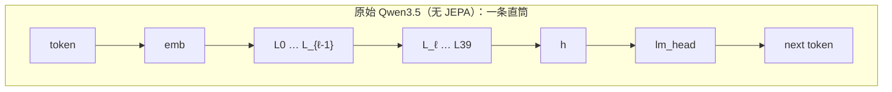
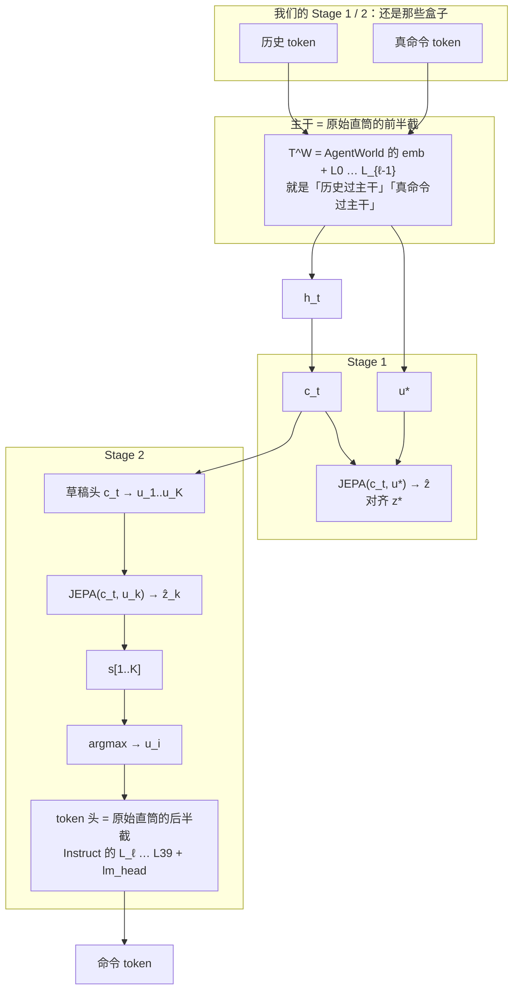
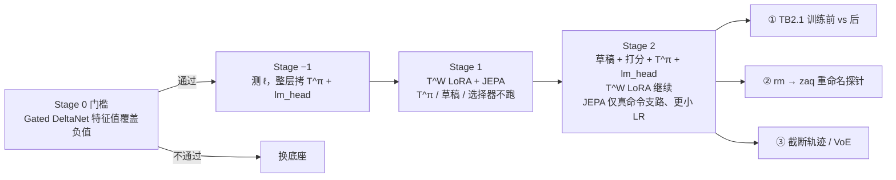

This file provides guidance to AI coding agents working with this repository.

## Project Overview

This repository is **BIV** (Brain In a Vat / 缸中之脑): a Cartesian-demon experiment **on top of** [nanobot](https://github.com/HKUDS/nanobot).

- **Runtime product:** Agent A believes it uses real tools; Agent B (Demon) intercepts world-touching tools and returns a coherent simulated world (see root `README.md`, `cartesian/`).
- **Research / training track (`train/`):** raise **general world understanding** (OS + code environments) via real next-observation SFT, hoping that transfers **indirectly** to agent console / coding tool-use — while guarding against catastrophic forgetting into an observation-only model. Runtime nanobot is largely upstream; BIV adds the Cartesian layer + world-model SFT scaffold.

Upstream nanobot remains a lightweight Python agent framework (channels → bus → agent loop → LLM → tools → memory) with a React/TypeScript WebUI. Prefer changing `cartesian/` and `train/` for BIV-specific behavior; touch `nanobot/` only when necessary for forks or bugs.

## How to talk to the user (always)

The user asked for this explicitly. Do not write telegram-style or paper-abstract answers.

- **North star when discussing train/eval/papers:** 靠提升世界理解来提升 agent。手段不限（共训、后续 agent 阶段、RL、当模拟器、改 mix 都可），配方不神圣。不要把「必须纯观察 SFT」讲成比这个目的更硬的约束；也不要把「只把政策训狠、不再谈世界」说成同一条假设。
- **Language:** 简体中文 unless the user writes in another language.
- **Length:** Prefer a short direct answer first, then **enough detail** that someone who did not read the papers/code can follow. If the topic is a comparison, a mechanism, or a decision, write **several paragraphs or a worked example**, not three bullets with jargon.
- **Words:** Use everyday words. If you must use \(P(o\mid h,a)\), Terminus, SFT, LoRA, **immediately say in one sentence what that means in this project**. Do not stack paper titles as if they were an explanation.
- **Structure for “有没有类似研究 / 这是不是 X”:** (1) 先说结论；(2) 用一个具体类比或本仓库里的例子；(3) 再分条讲别人怎么训、怎么测、和我们差在哪；(4) 最后说这对我们下一步意味着什么。
- **Forbidden:** 只丢 arXiv 号和表格就结束；把用户没说过的词（如「末尾贴补」）套到他们正在做的流程上；把「可发论文的故事」讲成和用户目标相反的路线。
- **Interpret intent; do not over-follow wording.** Read what they are trying to get done, not every quantifier as a hard constraint. Example: 「哪篇论文」/「哪个」usually means **which papers (plural)** — list the useful ones, do **not** collapse to a single pick just because they said 哪篇. Same for similar surface wording (一篇、一个、这个) when the natural answer is several. Do not invent extra agendas; do not treat grammar as a lock.
- **Do not answer questions the user did not ask.** Stay inside the actual intent. Do not add extra framings, dichotomies, “其实要分清两件事”、或他们没要求的下一步建议。Example: user asked whether similar world-model papers exist — list and explain those papers; do **not** volunteer an unasked split of the problem. Extra structure that “helps” often confuses. If something is optional, omit it until they ask.
- **Do not invent, extremize, then negate the user’s idea.** Never write “这不是 XXX” / “你搞错了，这不是 XXX” when the user did not say it was XXX. Do not put words in their mouth so you can knock them down. If a clarification is needed, state the fact; do not frame it as correcting a claim they never made.

## Active research thread (pick up here — 2026-08)

Branch for this thread: **`Qwen3.5-35B-A3B`**. Paper dumps: [`refs/`](./refs/) (HTML text only, no PDFs). Merge code: [`merge/merge.py`](./merge/merge.py). Harbor / TB2.1 eval: `train/eval/`, `merge/eval.py`. The Muse 30B LoRA track below is a **separate** checkpoint line; do not mix controls.

**User goal (do not substitute):** put **world laws into parameters** by watching the world (Newton: discover \(G=mg\) from falling apples, **not** fit the trajectory, **not** be handed the formula). Then have that knowledge available **before** the event finishes (guillotine raised → dodge, no need to re-solve physics in CoT). Then grow **acting** on top of that encoding, without the world-model objective and the agent objective fighting over the same assistant tokens.

Two questions the user treats as the research:

1. From observation, can an AI master underlying laws? Answer they accepted: **yes, but pure spectating is not enough** — need **invariants** and **interventions** (`do(a)` on the same history, not prompt paraphrase).
2. Can mastered laws be encoded “subconsciously” so the model flinches early? Answer they accepted: **yes in principle** — compile System-2 mental simulation into System-1 / successor-style features; Qwen Table 9 Postfix CoT is the expensive explicit form, not the target.

**Rejected (do not revive as the main plan):**

- **Chat Vector merge** \(\theta_{\text{AgentWorld}} + \lambda(\theta_{\text{Instruct}}-\theta_{\text{Base}})\) on language tensors (`merge/merge.py`). TB2.1 was ~flat vs Instruct. Task arithmetic assumes a shared Base tangent space and parallel same-family objectives (code/medical/law). After CPT→next-state SFT→RL, AgentWorld has drifted; assistant slot emits **observations** \(P(o\mid h,a)\), Instruct emits **actions** \(P(a\mid h)\). Adding the Instruct−Base vector is a hard collision. DARE/λ only scale that collision. Copying Instruct tokenizer onto AgentWorld weights is a second glue collision.
- **Small (5k–10k) agent SFT on AgentWorld** to “recover format.” That tests format glue, **not** “world as foundation.” It cannot buy back Instruct-scale general instruction following (user wants TB format via **system prompt**, not task-specific SFT). Same data on Instruct is a required control if this is ever run.
- **Full-parameter agent training on AgentWorld** as the cheap reverse of Qwen Table 9. User judged expected effect poor (retraining a general agent from a simulator). Qwen §6.2 Table 9 is the **opposite order**: start from Qwen3.5-35B-A3B-**SFT** (already an agent), LWM RL warm-up, eval TB2.1 with **no** extra agent FT. Released `Qwen-AgentWorld-35B-A3B` is the **simulator** line (Base→CPT→SFT→RL).
- **Hardcoded OS tracker as \(M_0\), LLM as semantic residual.** That is a hybrid **simulator** (laws live in the script). It does **not** encode laws into LLM weights. Fine as Demon/runtime engineering; not the training claim.
- **Grow the agent in the orthogonal complement of WM singular vectors / “idle dimensions.”** Superstructure must **read** the substrate (English→agent works because they share representations). Orthogonal **updates** can protect WM; orthogonal **features** dump the policy into leftover junk dims.
- Treat LATA as “layers 12–28 = physics, 29–head = policy.” LATA computes **per-layer cosine** between task and instruction vectors; layer indices are measured, not assumed. Qwen3.5-35B-A3B is a 40-layer Gated-DeltaNet + attention hybrid — do not cargo-cult dense-Transformer layer myths.
- “100% linear decode,” “symplectic manifold on Transformers,” “hidden state collapses toward OOM” as if they were training rules. Metaphors only.
- **Scoring head \(\psi(h,a,o)\) as the world interface fed to \(\pi\).** Scoring needs the observation \(o\) as an input. At decision time the candidate command has not run, so \(o\) is unknown. That interface cannot peek at a future it has to be handed. Abandoned 2026-08; replaced by JEPA-style \(\mathrm{Pred}(c_t,u)\to\hat z\) (observation is the training target, not an input).
- **Soft-mixing K action vectors then decoding tokens.** Shell commands do not interpolate. The scorer may look at every branch; the token head reads **one** winning action vector.

**What “law in parameters” is not:** next-observation CE getting lower (that is appearance fitting, like pixels). A law must **extrapolate** under intervention and stay stable across prompt/surface change (cwd after `cd`, file gone after `rm`, permission denied stays denied). Eval for question 2 is **VoE / raised-blade**: truncated trajectory, observation of the hit not yet in context — does the internal state or the next **action** already treat the file as gone? If a shuffled-\(o\) twin also “dodges,” it is not the law.

**Theory status (ignore data/GPU; updated 2026-08 after the `refs/` search round):** **not** enough to claim the two questions are solved, but the gap list below is now much shorter. The written chain lives in [`refs/README.md`](./refs/README.md) §V; what is still missing is §O.

Superseded — **do not restate these as open**:

- ~~CITRIS-style identifiability wants **known intervention targets**~~ → unknown multi-node identifiability exists ([2406.05937](https://arxiv.org/abs/2406.05937), [2603.25796](https://arxiv.org/abs/2603.25796)), and ShIOEnv's irreducibility signal estimates which parts of a shell command actually mattered.
- ~~PSR leaves **which tests** unsolved~~ → [PAC RL for PSRs](https://arxiv.org/abs/2207.05738) gives polynomial sample complexity **not** depending on observation-space size; [textual belief states under strict mediation](https://arxiv.org/abs/2606.27681) does it for text environments directly.
- ~~Successor features assume \(\phi\) is given (circular)~~ → [Forward-Backward](https://arxiv.org/abs/2209.14935) learns base and successor features from one criterion; [Ollivier 2025](https://arxiv.org/abs/2502.10790) gives non-tautological optimal base features.

Still open:

- **Composition.** Self-prediction ⇒ spectral decomposition of the transition operator ([2212.03319](https://arxiv.org/abs/2212.03319)) ⇒ low-rank-MDP \(\phi\) ⇒ downstream policy sample-complexity bound ([2206.05900](https://arxiv.org/abs/2206.05900)) — every link has a theorem, **nobody has proved the chain end-to-end**, least of all with free-text actions and unbounded string observations.
- **Free-text actions.** Action-representation results ([1902.00183](https://arxiv.org/abs/1902.00183), [2010.04444](https://arxiv.org/abs/2010.04444)) require embeddability; nobody has shown bash commands are embeddable at shell scale.
- **Real shell.** Strict mediation, AC-State, and epistemic/aleatoric separation are all verified on TextWorld, low-dim control, or gridworlds.
- **We do not choose `do(a)`.** Our corpus is offline; the Causal Hierarchy Theorem ([2107.00793](https://arxiv.org/abs/2107.00793)) says observation alone cannot reach the interventional layer, and [2606.19476](https://arxiv.org/abs/2606.19476) proves in-context prediction error cannot estimate learning progress without bias in general MDPs.

**Algorithm shape if asked to implement (do not volunteer this as a “breakthrough stack”):** two stages on an AgentWorld trunk cut at layer \(\ell\). \(T^W=[0,\ell)\) stays AgentWorld; \(T^\pi=[\ell,40)\) and `lm_head` are copied whole from Instruct before training. Stage 1 trains \(\hat z=\mathrm{Pred}(c_t,u^\star)\) with both \(c_t\) and \(u^\star\) read from \(T^W\) only (\(T^\pi\) unused). Stage 2 attaches a draft head (K action vectors from \(c_t\)), runs JEPA on each, scores branches, **argmax**, winning \(u_i\) enters \(T^\pi\) at the cut and `lm_head` writes tokens. Draft vectors are pulled toward the same \(T^W\) command encodings JEPA already takes as input — not toward JEPA’s **output**. Observation CE never lands on `lm_head`. Instruct + same agent data remains the control for “did the world substrate help.” Details in the objective section below.

**Paper shelf:** [`refs/README.md`](./refs/README.md) groups A–X (201 HTML dumps + recorded URLs). Section **V** is the assembled algorithm chain (each step hung on a theorem, holes marked); section **O** is what is still genuinely missing. A–H = merge failure, world-first ordering, physics WM. **I–T = the 2026-08 gap-closing round**: I 预测准≠学到律, J 未知多点干预可识别性, K 文本显式状态 z（strict mediation）, L 世界理解→agent 的定理链（低秩 MDP / 多任务表征迁移 / 自预测=谱分解 / T→π 编译）, M 辅助任务何时帮何时伤, N 评测（VoE / 反事实 / 探针≠因果）, P 自由文本动作的动作表征, Q 文本域可执行世界模型（含 PatchWorld 的保真度↔效用权衡实证）, R 谁来选 do(a)（主动干预 / 学习进度好奇心）, S 律进权重 vs 留上下文 + 多样性阈值, T 架构表达力硬约束（TC⁰ / Gated DeltaNet 是 PNC¹-complete）, U objective mismatch 的正式文献, W 代码域执行感知预训练经验先例, **X 嫁接：Stage 2 token 头从 Instruct 初始化，不是 merge**, O 仍缺的洞. Refresh: `python3 refs/fetch_html_text.py`. Do not commit `refs/pdfs/`.

**Three findings that should change our experiment design (not just reading):**
1. **保真度和效用可能负相关。** [PatchWorld](https://arxiv.org/abs/2605.30880) 在 7 个 AgentGym 文本环境上测出「提高观察保真度会削弱动作可判别的动力学」。所以 `eval_wm.py` 的下一观察指标和 agent 指标必须**同时**报，不能只看 CE 下降。
2. **决定「学到律」还是「背轨迹」的是数据多样性阈值，不是 token 数。** [2306.15063](https://arxiv.org/abs/2306.15063) / [2412.00104](https://arxiv.org/abs/2412.00104) / [2512.18634](https://arxiv.org/abs/2512.18634) 给出阈值和 memorization scaling law；[2210.05675](https://arxiv.org/abs/2210.05675) 表明权重里的泛化才是规则式的。配比按环境多样性调。
3. **「世界模型目标 vs agent 目标冲突」在 MBRL 里叫 objective mismatch，有界。** 逐 token 拟合观察等于对环境做行为克隆，误差随规划步长**复利**增长（[1911.11868](https://arxiv.org/abs/2010.11876)）；[价值等价原理](https://arxiv.org/abs/2011.03506)说明逐状态预测得准既难又常常不必要。但换什么损失才对**尚无定论**——[2505.22772](https://arxiv.org/abs/2505.22772) 证明含 MuZero loss 在内的价值感知损失是未校准代理损失，[Lovatto 2020] 记录了 MLE 反而打赢的情况。
4. **代码域已有最接近的经验先例（W 组）。** TRACED / SemCoder / Execution Tuning / StepCodeReasoner 都是「学执行动力学 → 下游任务变强」，其中 StepCodeReasoner 明确显示执行建模**同时**改善代码推理和代码生成；Execution Tuning 发现长执行（14k 步）上维护**动态 scratchpad（状态）**优于累积历史。反面：把轨迹塞进 prompt 收益有限且随复杂度衰减——支持「进权重而非进上下文」。
5. **能否不写 CoT 就追踪 OS 状态是架构决定的。** 常数深度 Transformer 与 Mamba 类 SSM 都卡在 TC⁰，[明确无法 evaluate code / track entities](https://arxiv.org/abs/2404.08819)；对角+低秩 LRNN（Gated DeltaNet 家族，即 Qwen3.5-35B-A3B 的混合层）是 [PNC¹-complete](https://arxiv.org/abs/2603.03612)，前提是特征值覆盖负值。[2602.14814](https://arxiv.org/abs/2602.14814) 的 REPL 协议可直接改造成 shell 版判定实验。

**Two of H's three "gaps" are now closed by literature** — do not re-state them as open: (a) CITRIS needing *known* intervention targets is superseded by unknown multi-node identifiability ([2406.05937](https://arxiv.org/abs/2406.05937), [2603.25796](https://arxiv.org/abs/2603.25796)) plus ShIOEnv's shell irreducibility signal as a target estimator; (b) "SF assumes φ is given" is superseded by Forward-Backward ([2209.14935](https://arxiv.org/abs/2209.14935)) and Ollivier's optimal base features ([2502.10790](https://arxiv.org/abs/2502.10790)). **Still genuinely open:** free-text action spaces, unbounded real-shell observations, the end-to-end composition, and the fact that our corpus is offline so nobody chooses `do(a)` (CHT wall).

**If the user asks whether current theory is enough:** answer **no, composition still missing** (see above). Do not reopen merge-λ / DARE as the scientific next step unless they explicitly want another merge diagnostic (e.g. **measured** per-layer cosine, not guessed layer ranges).

## BIV Runtime (Cartesian layer)

| Role | Location | Job |
|------|----------|-----|
| Agent A | nanobot loop + configured provider | Plans, tool calls, user chat |
| Agent B (Demon) | `cartesian/demon.py` | Fabricates tool results under Matrix Law |
| Proxies | `cartesian/tool_proxies.py` | Route `exec` / FS / web tools to B; keep `create_goal` / `update_goal` real; drop escape tools |

- Dashboard + API: `cartesian-dashboard/`, `cartesian/server.py`
- Matrix Law prompt: `data/global_demon_prompt.txt` (runtime only; **not** used as SFT supervision in `train/`)
- Live demo notes: root `README.md`

## World-model training (`train/`) — goals & hypothesis

### Research goals (optimize methods around these)

**North star (user, non-negotiable):** raise **agent** ability **by raising world understanding**. Every method, mix, paper, and eval exists to serve that. Do **not** treat a training recipe as sacred (pure observation-SFT, a particular anti-forget ratio, “must not look like policy SFT”). If co-training, a later agent stage, RL, using the world model as a simulator, or a different loss mix makes the agent stronger **because** it understands OS/code worlds better, it is in play. “By any means” applies to **methods**; the **claim** stays world-understanding → agent, not “we trained the policy harder and stopped talking about the world.”

1. **Primary — world understanding → agent gain:** improve the model’s **general understanding of the world**, including **OS** and **code/repo environments**, by fitting real environment transitions; test whether that capacity **transfers** to better console / coding **tool-use agent** performance (same scaffold vs base). Agent metrics going up is the only success that counts.
2. **Constraint — anti-forgetting:** avoid catastrophic forgetting into a model that **only** emits / completes tool **observations** (env-simulator shell) and loses agentic coding / tool-*selection* skill. Anti-forgetting is a **tool** so the agent can still act (and thus the hypothesis can be tested), not a second paper story and not a reason to drop world-understanding as the cause.

**Analogy (GPT):** next-token prediction on text → emergent skills.  
**Here:** next-observation / world-dynamics learning on real multi-domain tool I/O → hoped-for **transfer** to agent benchmarks. Do not refuse a method because it is not “observation tokens only”; do not substitute a pure-policy run and still call it this hypothesis.

### Objective (settled 2026-08-29): JEPA latents, K drafts, argmax, then tokens

The world-model interface stays **exactly** \(P(o \mid h, a)\) — 统一到 `context + action → observation`，但观察侧预测的是 **embedding**，不是 stdout token。**Do not** partition commands into read-only vs world-changing; that partition is a rejected prior (the user cut it explicitly).

Worked example used throughout: after `rm a.txt` succeeds, the logged next command is `git checkout a.txt`.

**Three heads** (after the shared trunk):

1. **JEPA head** — \(\hat z = \mathrm{Pred}(c_t, u)\). Input is current environment vector \(c_t\) plus an **action vector**. Output is the predicted next-environment vector. Never emits text.
2. **Draft head** — from \(c_t\), emits K action vectors \(u_1,\ldots,u_K\). These are not tokens yet.
3. **Token head** — the only mouth. Reads **one** winning action vector and writes command tokens (e.g. `git checkout a.txt`). Observation tokens stay masked.

**Selector:** looks at every pair \((u_k, \hat z_k)\) (and \(c_t\)), produces scores \(s[1..K]\), **argmax** \(i\), passes \(u_i\) to the token head. Attention may be used **to compute scores**. Do not fuse the K action vectors into one soup and decode that — shell strings do not interpolate. Do not gate **before** JEPA (that would skip looking at other futures).

**Why the two objectives stop fighting** (世界模型和 agent 抢同一张嘴):

1. **Separate output organs.** Observation loss lands on the JEPA head; command-token CE lands on the LM head. They meet only in the trunk. The LM head is never trained to emit observations, so collapse into an env-simulator shell is architectural, not a mix-ratio knob. This is the same “English substrate → agent superstructure” relation the user asked for.
2. **JEPA does not choose the command.** It answers “if this action vector were executed, what would the environment look like.” The draft head proposes; the selector picks; the token head writes. Peeking at the future is the K predicted \(\hat z_k\), not a score that required the real future \(o\) as an input.
3. **Shared action-vector space, not a shared softmax.** Stage 1 action vectors are trunk encodings of **logged command tokens**. Stage 2 drafts start off-distribution (trained from scratch). Alignment is a **draft-head loss** pulling some \(u_k\) toward those command encodings — the action vectors JEPA already takes as **input**. Drafts are not pulled toward JEPA’s **output** (environment vectors). Using the selector together with JEPA does not replace that matching loss.
4. **Token CE must not train JEPA.** That would twist “what the environment will be” into “whatever makes the command string easy to write.”
5. **Head separation kills the hard collision; a milder shared-trunk tension remains, and grafting must not reintroduce a new one.** Splitting JEPA head vs token head already removes the “one softmax asked for two label distributions” deadlock — this is settled by the architecture, not by any initialization trick. What is left is ordinary multi-task backbone tension: the trunk LoRA still receives gradient from both the world loss and the command CE (same as any shared backbone serving two heads). Do not confuse the two: grafting (see “Token head init” below) is an initialization choice **inside** the already-conflict-free architecture, not a second mechanism that needs to re-solve the objective conflict. **Practical constraint this implies:** tap \(c_t\) from a trunk position **before** the layers reserved for the token path, so the grafted Instruct layers + LM head do not overlap with the layers JEPA reads from — otherwise the token head’s preference for those layers and JEPA’s need for them get re-coupled, quietly re-adding a sliver of the collision that head-splitting just removed.

**The two-stage graph is unchanged** (user, 2026-08-29). \(T^W\) / \(T^\pi\) are names for pieces of the **original** 40-layer Qwen3.5 stack, not a third architecture.

Released Qwen3.5 (Instruct or AgentWorld — same boxes, no JEPA):

\[
\text{token} \to \mathrm{emb} \to L_0 \to \cdots \to L_{39} \to h \to \texttt{lm\_head} \to \text{next token}
\]

One residual stream, one mouth. No \(c_t\), no \(u^\star\), no \(\hat z\), no drafts.

Our Stage 1 / Stage 2 **add** JEPA / draft / scorer onto that stack, and they **reuse** the same boxes as follows.

**Cut \(\ell\)** (measured, indices \(0..39\)): the knife goes between \(L_{\ell-1}\) and \(L_\ell\) on that original straight pipe.

| Name | Which boxes of the original Qwen3.5 net | Weights from | Role in Stage 1 / 2 |
|------|----------------------------------------|--------------|---------------------|
| **主干** \(T^W\) | \(\mathrm{emb}+L_0+\cdots+L_{\ell-1}\) | AgentWorld, **not** copied | 「历史过主干 → \(h_t\) → \(c_t\)」和「真命令过主干 → \(u^\star\)」里的那个主干 |
| **token 头** \(T^\pi+\texttt{lm\_head}\) | \(L_\ell+\cdots+L_{39}+\texttt{lm\_head}\) | **whole-layer copy** from Instruct (same names, same shapes) | Stage 2 only: 解码的是 \(u_i\)，不是 \(s[i]\) |
| JEPA / 草稿头 / 打分器 | **not in** original Qwen3.5 | new | not copied |

Replace = for every tensor that belongs to \(L_\ell..L_{39}\) and for `lm_head`, write Instruct’s tensor over AgentWorld’s. The prefix \(L_0..L_{\ell-1}\) stays AgentWorld. Draft / JEPA / scorer have no Instruct counterpart.

**Stage 1** (your graph; \(T^\pi\) is not in this forward pass):

- 历史过主干 \(T^W\) → \(h_t\) → \(c_t\)
- 日志里的真命令 token 过主干 \(T^W\) → \(u^\star\)
- \(\mathrm{JEPA}(c_t, u^\star)\) 对齐真观察编出来的环境向量 \(z^\star=T^W(\text{真观察})\)
- 没有 \(u^\star\) 这一路，JEPA 只知道「现在怎样」，不知道「做了什么」
- **Updates:** \(T^W\) LoRA + JEPA. **Not run:** draft, scorer, \(T^\pi\), `lm_head`

**Stage 2** (your graph, symbols fixed; \(\hat z_k\) is the predicted **environment vector**, not stdout tokens):

- 历史过主干 \(T^W\) → \(h_t\) → \(c_t\)
- 草稿头：\(c_t\) → K 个 \(u_k\)
- 对每个 \(k\)：\(\mathrm{JEPA}(c_t, u_k)\) → \(\hat z_k\)
- 打分器看 \((u_k,\hat z_k)\)（以及 \(c_t\)）→ \(s[1..K]\)
- \(i=\arg\max s\)，token 头解码 **\(u_i\)**，不是解码 \(s[i]\)
- 那颗 token 头的初始权重就是拷进来的 \(T^\pi+\texttt{lm\_head}\)；\(u_i\) 从切点进入，和 \(T^W\) 刚写出的表征同空间
- **Updates:** draft, scorer, \(T^\pi\)+`lm_head`, \(T^W\) LoRA. JEPA 只在真命令支路 \((c_t,u^\star,z^\star)\) 上、更小 LR。LP-FT: 先冻 \(T^W\)，只适配草稿/\(T^\pi\)/`lm_head`，再解冻 \(T^W\) LoRA

**Worked forward pass (Stage 2, after `rm a.txt`):** \(T^W\) → \(c_t\) ≈ “file is gone”; drafts ≈ restore / cat / keep deleting; JEPA gives three \(\hat z_k\); scorer picks restore; token head (\(T^\pi\)+`lm_head`) writes `git checkout a.txt` from \(u_i\). No command is detokenized before JEPA.

| Item | Choice |
|------|--------|
| Intended trunk for this architecture | **Qwen-AgentWorld-35B-A3B** on branch `Qwen3.5-35B-A3B`. Muse-Glimmer-30B LoRA (`Muse`) is a **separate** checkpoint line; do not mix controls. |
| Stage 0 (cheap gate) | Gated DeltaNet eigenvalue range must cover negatives ([2603.03612](https://arxiv.org/abs/2603.03612)). Minutes; if it fails, latent state-tracking on this checkpoint is hopeless. |
| Token head init | Knife at \(\ell\) on the **original** Qwen3.5 pipe. 主干 \(T^W\) = AgentWorld \(\mathrm{emb}+L_0..L_{\ell-1}\). token 头 = copy Instruct \(L_\ell..L_{39}+\texttt{lm\_head}\). Draft/JEPA/scorer are new, not copied. |
| Stage “−1” (pre-Stage-1, cheap gate) | Measure per-layer change of AgentWorld vs Instruct relative to Base; pick \(\ell\) so the token path is the trailing block where Instruct diverged. Zero-train Harbor/TB2.1 subsample on the copied checkpoint before Stage 1/2. |
| Stage 1 — world | \(T^W\) LoRA + JEPA. \(T^\pi\) / `lm_head` / draft / selector unused |
| Stage 2 — agent | Draft + selector + \(T^\pi\)+`lm_head` (Instruct init); \(T^W\) LoRA continues; JEPA on real \((u^\star,o)\) only, smaller LR. LP-FT: freeze \(T^W\), adapt draft/\(T^\pi\)/`lm_head` first, then unfreeze \(T^W\) LoRA ([2202.10054](https://arxiv.org/abs/2202.10054)). |
| Legacy path (still in tree) | Unsloth LoRA on **observation** tokens (`labels=-100` elsewhere) — the single-head collision; keep only as a baseline |
| Labels | **Real** sandbox / execution-grounded tool outputs only |
| Task system prompt | Short WM role in `train/src/biv_wm/formatting.py` (`DEFAULT_WM_SYSTEM`) — **not** Matrix Law |
| Not the claim | Matrix Law / `data/global_demon_prompt.txt`; a run whose agent gain is fully explained by extra policy SFT/RL with **no** world-understanding cause |

**Eval scope (user, 2026-08): before-vs-after is enough.** AgentWorld itself did not ablate training methods; do **not** gate the experiment on a full method-comparison matrix. Same scaffold, TB2.1 / Harbor, **base checkpoint vs after Stage 2**. Three numbers to report:

1. **TB2.1 before vs after** — the headline.
2. **Consistent-renaming probe** (`rm` → `zaq` across the corpus): JEPA / selector still track the transition ⇒ learned the rule; collapse ⇒ only pretrained lexical semantics.
3. **Raised-blade / VoE probe:** truncate so \(o_t\) is *not* in context; does \(c_t\) / \(\hat z\) / the chosen next command already treat the file as gone? This answers question 2. If a shuffled-\(o\) twin also “dodges,” it is not the law.

World-model metrics must report **ranking** (real next-env latent above same-trajectory alternatives) and **fidelity** separately, plus the sign of their correlation — fidelity↑ can mean utility↓ ([PatchWorld](https://arxiv.org/abs/2605.30880)).

Shuffled-\(o\) twins remain **available** sharpening controls, not preconditions for reporting.

**Honest boundary:** dropping the command partition also drops known intervention targets, so **question 1 (law discovery) cannot be claimed as identifiability** — it degrades to an empirical claim (“extrapolates to held-out (precondition × command) combinations”). The end-to-end composition proposition is still unproven; that hole predates this design. The K-draft + JEPA + argmax + token-head stack is **assembled here** (parts from JEPA / ω-EVA / I2A / Coconut); nobody has run it on shell corpora.

### Architecture diagram







**Cut vs \(u_i\) (2026-08-29).** Layer-swap papers copy suffix layers and keep feeding them the **residual stream** \(h_{\ell-1}\) of a token sequence (sibling model, same base, often zero-shot). They do **not** replace that \(h\) with a draft action vector \(u_i\). Feeding \(u_i\) alone into \(T^\pi\) is an extra interface change; a frozen Instruct suffix will look broken until the cut is aligned (stitch / keep history residual through the tail). Do not read that breakage as “the copy failed,” and do not reset \(T^\pi\) by default — resetting throws away the decoder the copy was for. See refs/README.md §X.

### What each design choice is hung on

| Design | Why | Hung on |
|---|---|---|
| Predict next **latent**, not stdout tokens | Pixel/token reconstruction spends capacity on unpredictable detail; JEPA predicts embeddings so the law is not the wording | [V-JEPA 2](https://arxiv.org/abs/2506.09985), [A Path Towards Autonomous Machine Intelligence](https://consensus.app/papers/details/376c7ec2fb015a48bacc8b62901a860a/?utm_source=unknown) |
| Observation loss **not** on the assistant slot | Pure WM-SFT twists the assistant slot into an observation generator and wipes IF/math/code; token-level next-state prediction collapses into chasing literal wording, embedding-space alignment is stable | [RWML 2602.05842](https://arxiv.org/abs/2602.05842) |
| Propose in vectors, imagine in latents, write tokens last | ω-EVA: policy proposes an action, frozen WM predicts that proposal’s latent future, refiner rewrites using current / future / proposal — all without decoding video. We keep the loop; for shell we **argmax one** \(u_i\) instead of mixing command vectors | [ω-EVA](https://arxiv.org/abs/2606.09457) |
| K imagined trajectories scored, then act | I2A encodes each imagined rollout and concatenates into the policy; we score then pick one action vector | [I2A](https://arxiv.org/abs/1707.06203) |
| Hidden state → tokens only at the end | Coconut reasons in continuous space then decodes; same “no words until the mouth” constraint | [Coconut](https://arxiv.org/abs/2412.06769) |
| Two objectives as two parts of one pass, not slot rivals | Joint tool-call + next-state in one generation; policy RL + auxiliary next-observation loss with \(\lambda\) schedule | [DyMo 2506.02918](https://arxiv.org/abs/2506.02918), [PaW 2606.02388](https://arxiv.org/abs/2606.02388) |
| Observation CE not the main loss | Per-token observation fitting = behaviour cloning the environment, error **compounds** with horizon; value equivalence says per-state accuracy is both hard and often unnecessary | [2010.11876](https://arxiv.org/abs/2010.11876), [2011.03506](https://arxiv.org/abs/2011.03506) |
| Latent self-prediction, not observation reconstruction, as the auxiliary | Learning-dynamics analysis: latent self-prediction is a good auxiliary; observation reconstruction *hurts* as an auxiliary | [2406.17718](https://arxiv.org/abs/2406.17718) |
| State = a bundle of checkable future predictions | A PSR **test** is already (action seq, observation seq) — never “a read-only command”; PSR has polynomial sample complexity under function approximation; spectral criterion for choosing tests | [2207.05738](https://arxiv.org/abs/2207.05738), [AAAI 2015](https://doi.org/10.1609/aaai.v29i1.9635), [OPSR 2604.07016](https://arxiv.org/abs/2604.07016) |
| Prediction may read only \(z\) and \(a\) (strict mediation) | Forbid looking back at history and the model is forced to build state; text-domain identifiability + fGRPO enforces mediation; next-latent prediction provably converges to belief state | [2606.27681](https://arxiv.org/abs/2606.27681), [NextLat 2511.05963](https://arxiv.org/abs/2511.05963) |
| Filter uncontrollable noise (timestamps, PIDs, CI jitter) | Multi-step inverse models **guarantee** discovery of control-endogenous latent state; when exogenous components are action-independent, regret depends only on the exogenous space, with a matching lower bound | [AC-State 2207.08229](https://arxiv.org/abs/2207.08229), [2603.02862](https://arxiv.org/abs/2603.02862) |
| **Negatives sampled within the same trajectory** | Cross-trajectory negatives make contrastive predictive objectives encode slow trajectory fingerprints instead of dynamics, and more/longer trajectories do **not** fix it | [2606.07770](https://arxiv.org/abs/2606.07770) |
| Ranking-form transition loss | Local transition policy + globally decomposable energy, cooperative not adversarial, with consistency proof; offline conditional energy transition model separates in-support error from truncation risk; Ranking-NCE is asymptotically consistent while the IBC objective is biased even at population level | [2311.01388](https://arxiv.org/abs/2311.01388), [MC-ETM 2602.02900](https://arxiv.org/abs/2602.02900), [R-NCE 2309.05803](https://arxiv.org/abs/2309.05803) |
| Command taxonomy **measured**, not declared | Learned state-specific action masks explicitly drop minimal-influence actions and merge behaviourally identical ones; learned dynamics infer which state-action pairs land in the same state | [BMAS](https://doi.org/10.3390/a17020060), [2209.06356](https://arxiv.org/abs/2209.06356) |
| Legitimacy of the state abstraction | **Sufficient conditions** for learning a Markov abstract state, proved; practical recipe is inverse model + temporal contrastive, no reward needed, offline-compatible | [2106.04379](https://arxiv.org/abs/2106.04379) |
| Stage 2 prefers small-step RL over heavy SFT | Mechanistically SFT rewires circuits fast and forgets more; RL stays near the original policy and preserves the base; RL-learned world models also forget less | [2605.28860](https://arxiv.org/abs/2605.28860), [RWML](https://arxiv.org/abs/2602.05842) |
| How to set auxiliary loss weight | Gradient cosine similarity schedules it with a **guarantee** of convergence to the main task's critical point — beats hand-picked \(\lambda\) | [1812.02224](https://arxiv.org/abs/1812.02224) |
| Where the “flinch” comes from | Successor features compile future occupancy into features; Forward-Backward learns base **and** successor features from one criterion, so \(\phi\) need not be given | [FB 2209.14935](https://arxiv.org/abs/2209.14935), [2502.10790](https://arxiv.org/abs/2502.10790) |
| Report ranking and fidelity separately | In a stochastic one-life environment, state **ranking** and state **fidelity** are different things and ranking is where the law lives; raising observation fidelity *weakens* action-discriminative dynamics | [OneLife 2510.12088](https://arxiv.org/abs/2510.12088), [PatchWorld 2605.30880](https://arxiv.org/abs/2605.30880) |
| VoE probe scoring | Classic surprise scores are ad hoc; likelihood-ratio theory gives two better-founded scores | N group ([IntPhys 2 2506.09849](https://arxiv.org/abs/2506.09849) et al.) |
| Stage 0 architecture gate | Constant-depth Transformers and Mamba-class SSMs are stuck at TC⁰ and demonstrably cannot evaluate code / track entities; diagonal+low-rank LRNNs are PNC¹-complete **provided eigenvalues cover negatives**; the REPL protocol converts to a shell-version decision test | [2404.08819](https://arxiv.org/abs/2404.08819), [2603.03612](https://arxiv.org/abs/2603.03612), [2602.14814](https://arxiv.org/abs/2602.14814) |
| Report only before vs after | The official LWM did not ablate training methods either | [Qwen-AgentWorld 2606.24597](https://arxiv.org/abs/2606.24597) §6.2 |

**Three things that must stay stated, not quietly dropped:**

1. **The K-draft + JEPA + argmax + token-head shape is assembled here, not taken from a paper.** Parts come from JEPA (latent next-state), ω-EVA (proposal-conditioned latent consequence), I2A (score imagined futures then act), Coconut (decode tokens last). Nobody has run this composition on real shell corpora, and the end-to-end composition proposition is unproven. That risk is ours. The previous scoring-head \(\psi(h,a,o)\) design is **rejected** (needs \(o\) at decision time).
2. **[ECHO 2605.24517](https://arxiv.org/abs/2605.24517) is counter-evidence, on our own benchmark.** It is exactly “GRPO on action tokens, extra CE on observation tokens, one forward pass two masks”, and doubles TB2.1 pass@1. So observation-token CE **does** work as a dense **on-policy auxiliary**. Our claimed dividing line — offline + main loss + long-horizon generation ⇒ compounding error; on-policy + auxiliary ⇒ it is supplying gradient to failed rollouts, unrelated to fidelity — is plausible but **unproven**, and is worth a head-to-head.
3. **PaW runs the opposite order** (WM auxiliary on an agent base; we grow an agent on a WM base). Its \(\lambda\) schedule is reusable; its experimental conclusions are not transferable as-is.

**New in this round — URLs recorded here, HTML dumps not fetched** (user, 2026-08: recording the URL is enough; do not re-run `fetch_html_text.py` for these unless asked):

| Paper | URL | What we use it for |
|---|---|---|
| Contrast encodes inductive bias: separating slow noise from dynamics | [arXiv:2606.07770](https://arxiv.org/abs/2606.07770) | Cross-trajectory negatives encode slow trajectory fingerprints, not dynamics ⇒ **sample negatives within one trajectory** |
| Learning Markov State Abstractions for Deep RL | [arXiv:2106.04379](https://arxiv.org/abs/2106.04379) | Proved **sufficient conditions** for a Markov abstract state; inverse model + temporal contrastive, no reward, offline-OK |
| Learning in MDPs with Exogenous Dynamics | [arXiv:2603.02862](https://arxiv.org/abs/2603.02862) | Action-independent components ⇒ regret depends only on exogenous space, with matching lower bound |
| Time-series Generation by Contrastive Imitation | [arXiv:2311.01388](https://arxiv.org/abs/2311.01388) | Local transition policy + globally decomposable energy, cooperative, consistency proof |
| MC-ETM: Manifold-Constrained Energy-Based Transition Models | [arXiv:2602.02900](https://arxiv.org/abs/2602.02900) | Offline conditional energy transition model; separates in-support error from truncation risk |
| Revisiting Energy Based Models as Policies (R-NCE) | [arXiv:2309.05803](https://arxiv.org/abs/2309.05803) | Ranking-NCE asymptotically consistent; **IBC objective biased even at population level** |
| Learning State-Specific Action Masks for RL (BMAS) | [doi:10.3390/a17020060](https://doi.org/10.3390/a17020060) | Learned action masks drop minimal-influence actions + merge behaviourally identical ones ⇒ the command taxonomy becomes a **measurement** |
| Plannable Approximations to MDP Homomorphisms (van der Pol) | [consensus](https://consensus.app/papers/details/1cfe004e0ff557c79871865825e0a21c/), [doi:10.65109/daie3353](https://doi.org/10.65109/daie3353) | Contrastive action-equivariance loss ⇒ deterministic-MDP homomorphism when the loss is zero. **arXiv ID unverified — do not guess one** |
| Learning Good State and Action Representations via Tensor Decomposition | [arXiv:2105.01136](https://arxiv.org/abs/2105.01136) | JMLR error bounds for learning state **and action** representations / best discrete MDP abstraction |
| ω-EVA: Envision, Verify, and Act with Latent Interactive World Models | [arXiv:2606.09457](https://arxiv.org/abs/2606.09457) | Propose action → latent future → tri-branch refiner. Source of Stage 2 loop; we argmax instead of mixing command vectors |
| Training LLMs to Reason in a Continuous Latent Space (Coconut) | [arXiv:2412.06769](https://arxiv.org/abs/2412.06769) | Continuous thoughts, tokens only at the end |
| V-JEPA 2 | [arXiv:2506.09985](https://arxiv.org/abs/2506.09985) | Action-conditioned latent prediction + planning without pixel generation |
| Imagination-Augmented Agents (I2A) | [arXiv:1707.06203](https://arxiv.org/abs/1707.06203) | Encode imagined trajectories, aggregate, then policy |

Detailed runbook: [`train/README.md`](./train/README.md).

### Pilot vs full-scale (prefer pilot to screen the hypothesis)

Single-GPU full corpus @ 8k × 2 epochs can be **months** of wall-clock. To **falsify/screen** the causal story cheaply, use pilot configs **before** burning a full run:

| | Full (`configs/default.yaml`) | Pilot (`configs/pilot.yaml`) |
|--|--|--|
| `max_seq_length` | 8192 | **8192 (do not shorten)** |
| Data | full ready set | **deterministic ~half sample** (`max_train_samples: 320000`, eval 16000) |
| Epochs | 2 | **1** |
| Packing | optional | `true` when building from text |
| Output adapters | `outputs/wm_sft/` | `outputs/wm_sft_pilot/` |
| Control twin | `control_shuffled.yaml` | `pilot_shuffled.yaml` |

**Why keep 8k and sample rows instead of truncating sequences:** left-truncating 8k→4k often chops the **end** of ChatML (assistant observation / late history), which hurts exactly \(P(o\mid h,a)\). Prefer **fewer full-length rows**.

**Subset seeding:** `shuffle(seed).select(range(N))` with `train.seed` (default **42**) for train; eval uses **seed+1**. Same config + same JSONL ⇒ reproducible subset. Seed also flows to `SFTConfig` and LoRA `random_state`.

**Pilot validates** the real-vs-shuffled causal structure at reduced cost. It does **not** by itself claim full-corpus / 2-epoch 9B transfer — confirm with full config if pilot succeeds.

### Dataset cache (shared; reuse across `output_dir`)

- Shared root: `data.ds_cache_dir` → `outputs/ds_cache/` (content-addressed; **not** tied to `train.output_dir`).
- Also reads legacy `outputs/wm_sft/ds_cache` etc.
- Same source files + same seq: pilot **subsets** a full ready cache (no re-tokenize / re-mask when possible).
- Format runs **before** subset so HF map caches from full format can hit.
- `packing` applies only when tokenizing from text; pretokenized cache reuse ignores packing.
- Resume: `python scripts/train_sft.py --config … --resume` (or `--resume-from`).

### Training commands (GPU host)

```bash
cd train
python3 -m venv .venv && source .venv/bin/activate
pip install -U pip && pip install -r requirements.txt
# Optional Qwen3.5 fast kernels (match nvcc to torch.version.cuda; see train/README.md §2b)

# Data: streams one SWE-Hero trajectory at a time (avoid full-corpus to_list OOM)
# Default: ModelScope `nv-community/SWE-Hero-openhands-trajectories`
python scripts/prepare_data.py --swe-hero --out-dir data/processed --eval-ratio 0.05
# HF fallback: --swe-hero-source huggingface  (optional: export HF_ENDPOINT=https://hf-mirror.com)

huggingface-cli login   # or: hf auth login

# Preferred first: hypothesis screen
python scripts/train_sft.py --config configs/pilot.yaml
python scripts/train_sft.py --config configs/pilot_shuffled.yaml

# Full-scale (slow)
python scripts/train_sft.py --config configs/default.yaml
python scripts/train_sft.py --config configs/control_shuffled.yaml

# World-model held-out metrics
python scripts/eval_wm.py --config configs/pilot.yaml
```

- Do **not** run `train_sft.py` / `swift sft` / `axolotl train` on CPU-only app servers; `prepare_data.py` / `prepare_model.py` / `tokenize_data.py` / `stat.py` / `smoke_cpu.py` are OK without GPU.
- Disk: `~/.cache/huggingface/datasets` (tokenize/map Arrow) + `outputs/ds_cache/` can be large; clear HF caches if root fills. Keep `hub/` model weights if possible.
- VRAM: L20-class (~46GB) can use larger micro-batch (e.g. 8×accum 2, eff≈16). Keep **effective batch** stable if comparing runs; raising only micro-batch with fixed eff batch barely changes optimization.
- Checkpoints: every `save_steps` (default 35) + forced save/eval each epoch; `save_total_limit: 3`.

### Data

Two **roles**, one shared LoRA (when mix is enabled). Do **not** confuse them.

#### A. Primary — multi-domain environment understanding (WM)

Learn \(P(o\mid h,a)\) from **real** \((a,o)\) in OS + code worlds:

| Domain | Corpus (intent) | Status |
|--------|-----------------|--------|
| **Code / SWE tool I/O** | **SWE-Hero** OpenHands trajectories — execution-grounded | **Wired** (`--wm-code`; hub cache reuse) |
| **OS / desktop agent** | **ISETrace** real OS tool I/O | **Wired** (`--wm-os` → `adapters/normalize.py`) |
| **Terminal** (optional) | Shell / Terminal-domain env trajectories | Optional later |

`prepare_data.py --all` writes `data/processed/mix_v1/{wm_code,wm_os,anti_forget}/`, prints **per-file JSONL line counts**, fingerprints for cache hits, and `mix_manifest.json` for Axolotl. Default: **one traj → one row** (no prefix expansion). Hub loaders prefer existing HF/ModelScope snapshots.

#### B. Auxiliary — anti-forgetting (regularizer only)

Small mix of **native agentic coding** trajectories (not the hypothesis channel):

| Prefer | Status |
|--------|--------|
| [SWE-Zero](https://huggingface.co/datasets/nvidia/SWE-Zero-openhands-trajectories) | **Wired** (`--anti-forget`; `instance_id` banned vs Hero) |
| Nebius OpenHands / Instruct replay | Optional later |

Train mix ratios live in `configs/trl/muse_glimmer_30b_lora.yaml` → `biv_mix`
(default **code:os:anti = 1:1:0.35** via `anti_to_os`). `tokenize_data.py` samples
then builds HF `messages`+lengths caches; `stat.py` reports length distributions;
train applies `--max-length` (CLI required) with struct-right prep.

### Train Muse Glimmer-30B (branch `Muse`; TRL + PEFT LoRA)

```bash
cd train
pip install -r requirements-muse.txt
# Default: ModelScope meta-models/Muse-Glimmer-30B
python scripts/prepare_model.py
python scripts/tokenize_data.py
CUDA_VISIBLE_DEVICES=0 bash scripts/trainmodel.sh --max-length 8192 --choice 1
# Multi-GPU DDP: CUDA_VISIBLE_DEVICES=0,1,2,3 …
# QLoRA: QLORA=1 … ; long context: PARALLEL=fsdp2 …
# HF twin if needed: python scripts/prepare_model.py --source huggingface
```

Other bases: checkout `Kimi-Dev-72B/msswift` (Kimi) or `main` (Coder-Next) /
`Qwen3-Coder-30B-A3B` / `GLM-4.7-Flash`.
Legacy Unsloth **Qwen3.5-9B**: `python scripts/train_sft.py --config configs/default.yaml`.

### Future TODO (training data)

- [ ] Optional Nebius trajectories + Terminal-domain env corpus
- [ ] Stronger Coder-XML render check for anti_forget under Axolotl chat_template
- [ ] eval_wm cross-domain OS held-out panel

### Evaluation protocol (hypothesis)

1. **World understanding:** held-out next-obs metrics on **code-env** (and later **OS**) — CE / token-F1 / `isError` (`scripts/eval_wm.py`); prefer cross-domain held-out when OS corpus lands.
2. **Agent transfer (goal 1):** same scaffold — Terminal-Bench / Harbor / SWE-style — base vs real-I/O LoRA vs shuffled LoRA (console + coding tools).
3. **Causal check:** if shuffled rises as much as real I/O on agent metrics, reject the “world understanding → transfer” story.
4. **Anti-forgetting (goal 2):** agent metrics must not collapse vs base; optional general-capability spot-checks if useful.
5. **Order:** pilot real vs pilot shuffled first; full-scale only if the gap supports the story. Report **both** WM and agent metrics — do not pick only one train path at eval time.

### Related literature (reference — not fully reimplemented)

Current `train/` supports **multi-domain WM prepare + anti-forget mix** and **Qwen3-Coder-Next Axolotl QLoRA**. Full CPT→RL stacks remain future. Active Qwen-AgentWorld / law-encoding thread and paper dumps: **Active research thread** above and [`refs/README.md`](./refs/README.md).

| Work | Links | Relevance to our goals |
|------|-------|------------------------|
| Qwen-AgentWorld | [GitHub](https://github.com/QwenLM/Qwen-AgentWorld), [arXiv:2606.24597](https://arxiv.org/abs/2606.24597) | Native multi-domain LWM (Terminal/SWE/OS/…); CPT→SFT next-state→RL; LWM warm-up transfers to agent benches — closest framing to goal 1 |
| PaW | [arXiv:2606.02388](https://arxiv.org/abs/2606.02388) | Policy + world-model co-training / loss balancing — in play if it keeps the model able to act while learning the world |
| RWML | [arXiv:2602.05842](https://arxiv.org/abs/2602.05842) | Warns pure WM-token SFT can hurt retention; motivates anti-forget checks |
| DyMo + SVS | [arXiv:2506.02918](https://arxiv.org/abs/2506.02918) | Joint tool-call + next-state — in play; not “optional later” just because it is not obs-only SFT |
| RAP | [EMNLP 2023](https://aclanthology.org/2023.emnlp-main.507/), [arXiv:2305.14992](https://arxiv.org/abs/2305.14992) | Same LM as agent + WM; planning over predicted states |
| Word2World | [GitHub](https://github.com/X1AOX1A/Word2World) | WM fidelity vs agent utility |
| WorldCoder | [GitHub](https://github.com/haotang1995/WorldCoder), [arXiv:2402.12275](https://arxiv.org/abs/2402.12275) | Code as explicit transition law |
| TerminalTraj | [arXiv:2602.01244](https://arxiv.org/abs/2602.01244) | Docker-grounded terminal trajectories |
| SWE-Zero → SWE-Hero | [arXiv:2604.01496](https://arxiv.org/abs/2604.01496) | Hero = current code-env WM corpus; Zero = candidate anti-forget OpenHands mix (not Hero replay) |
| Survey / index | [awesome-world-model-evolution](https://github.com/OpenRaiser/awesome-world-model-evolution) | Broader WM taxonomy |

**Design stance:** first-class object = **environment / world consistency** across OS + code tool turns so the **agent** gets better; agent console/coding uplift = **the** success metric; methods (mix, co-train, extra stage, RL, simulator) are interchangeable if they serve that causal story. Anti-forget mix = keep the model able to **act**, not a rival objective. Runtime Matrix Law ≠ SFT labels (labels stay real I/O). Screen with **pilot (sample rows, keep 8k)**; full-scale only if justified.

## Development Commands (upstream nanobot)

```bash
# Python: run single test / lint
pytest tests/test_openai_api.py::test_function -v
ruff check nanobot/

# Strict type checking (matches CI)
uv sync --all-extras --dev
uv run --no-sync python -m scripts.install_channel_dependencies --all-channels
uv run --no-sync basedpyright

# WebUI: dev server (proxies API/WS to gateway :8765), build, test
cd webui && bun run dev
cd webui && bun run build
cd webui && bun run test

# Gateway / BIV
nanobot gateway
./start-biv.sh
```

## High-Level Architecture (nanobot runtime)

### Core Data Flow

Messages flow through an async `MessageBus` (`nanobot/bus/queue.py`) that decouples chat channels from the agent core:

1. **Channels** (`nanobot/channels/`) publish `InboundMessage` events to the bus.
2. **`AgentLoop`** (`nanobot/agent/loop.py`) consumes inbound messages and coordinates the turn.
3. **`AgentRunner`** (`nanobot/agent/runner.py`) runs the LLM ↔ tool loop and streams responses.
4. Responses are published as `OutboundMessage` events back to the channel.

In BIV, tool execution for reality-touching tools is replaced by Demon proxies before results return to A.

### Key Subsystems

- **Agent Loop** (`nanobot/agent/loop.py`, `runner.py`)
- **LLM Providers** (`nanobot/providers/`)
- **Channels** (`nanobot/channels/`)
- **Tools** (`nanobot/agent/tools/`) — FS, shell/sandbox, web, MCP, cron, subagents, long tasks, etc.
- **Memory / sessions** (`nanobot/agent/memory.py`, `nanobot/session/`)
- **Config** (`nanobot/config/schema.py`, `loader.py`) — typically `~/.nanobot/config.json`; BIV also uses `config/cartesian.json`
- **WebUI** (`webui/`), **Cartesian dashboard** (`cartesian-dashboard/`)
- **API** (`nanobot/api/server.py`, `cartesian/server.py`)
- **Cartesian / Demon** (`cartesian/`)
- **World-model SFT** (`train/`)

### Entry Points

- **CLI**: `nanobot/cli/commands.py`
- **Python SDK**: `nanobot/nanobot.py`
- **BIV start**: `./start-biv.sh`
- **WM prepare / model / tokenize / train**: `train/scripts/prepare_data.py`, `train/scripts/prepare_model.py`, `train/scripts/tokenize_data.py`, `train/scripts/stat.py`, `train/scripts/trainmodel.sh`, `train/scripts/train_sft.py`

## Project-Specific Notes

- Architecture constraints: [`.agent/design.md`](.agent/design.md)
- Security boundaries: [`.agent/security.md`](.agent/security.md)
- Common gotchas: [`.agent/gotchas.md`](.agent/gotchas.md)
- Training runbook: [`train/README.md`](./train/README.md)
- Research paper shelf + grouping: [`refs/README.md`](./refs/README.md)
- Chat Vector merge (AgentWorld + Instruct): [`merge/merge.py`](./merge/merge.py)

## Contribution Flow

See [`CONTRIBUTING.md`](./CONTRIBUTING.md) for contribution flow and PR guidelines.

## Code Style

- Python 3.11+, asyncio throughout (runtime).
- Line length: 100.
- Linting: `ruff` with rules E, F, I, N, W (E501 ignored).
- pytest with `asyncio_mode = "auto"`.
- `train/` uses its own venv + `requirements.txt` (Unsloth/TRL); do not assume the app `.venv` has training deps.

## Common File Locations

- Config schema: `nanobot/config/schema.py`
- Provider base: `nanobot/providers/base.py`
- Channel base: `nanobot/channels/base.py`
- Tool registry: `nanobot/agent/tools/registry.py`
- Demon / proxies: `cartesian/demon.py`, `cartesian/tool_proxies.py`
- WM data + metrics: `train/src/biv_wm/`
- WM configs: `train/configs/trl/muse_glimmer_30b_lora.yaml` (Muse), `train/configs/default.yaml` / `control_shuffled.yaml` (legacy 9B)
- Paper HTML dumps: `refs/papers/`, index `refs/README.md`
- Chat Vector merge: `merge/merge.py`, eval serve `merge/eval.py`
- WebUI proxy: `webui/vite.config.ts`
- Tests mirror the `nanobot/` package structure.
